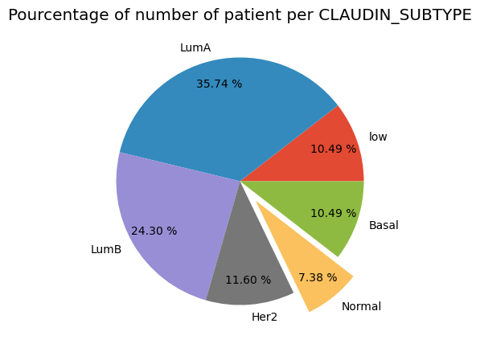
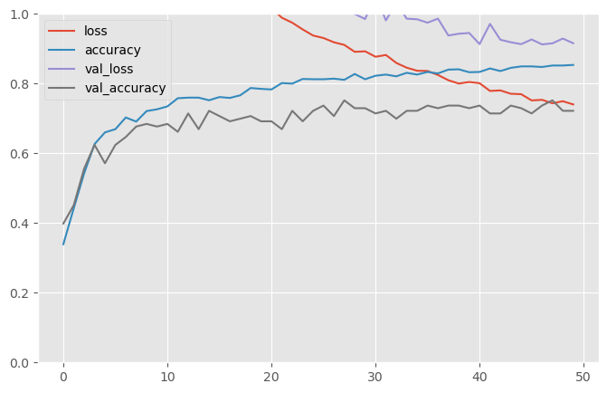
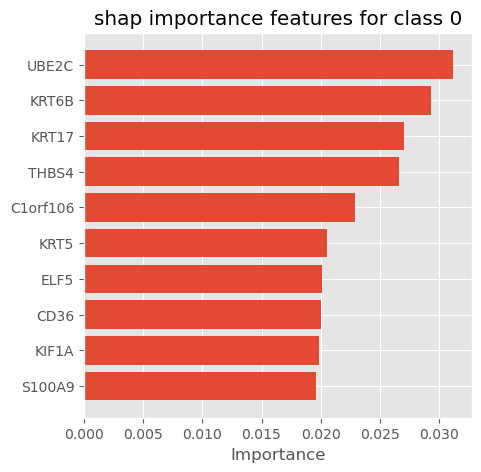
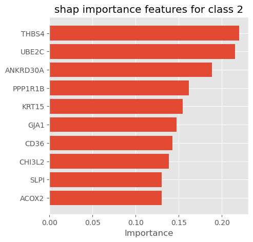
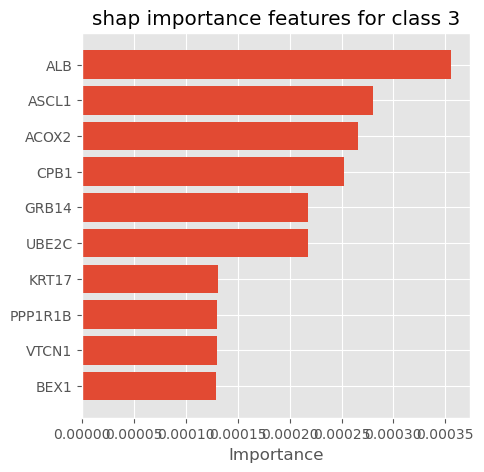
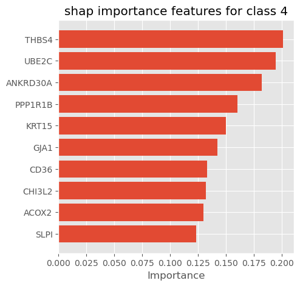
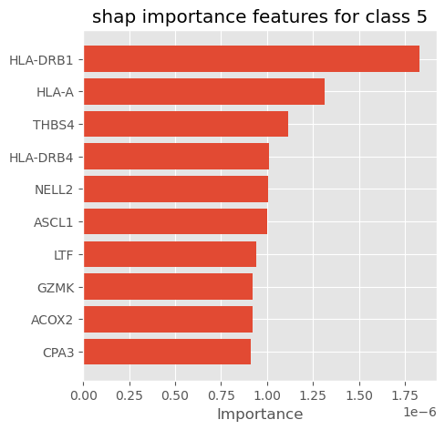
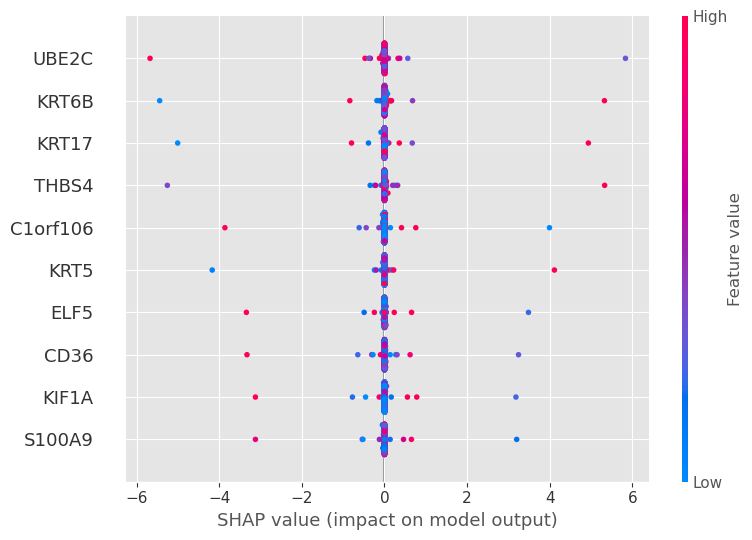
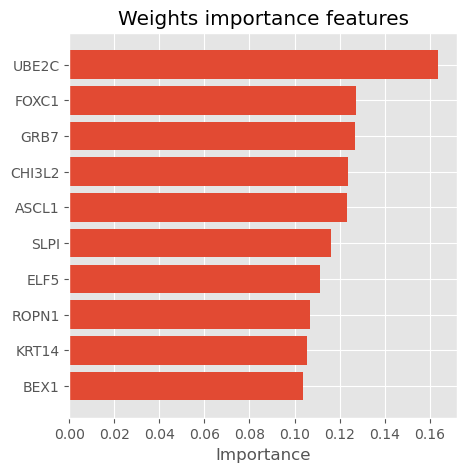

# Explain tensorflow model using Shap and Model Weights on METABRIC data


```python
from platform import python_version
python_version()
```


    '3.8.18'


```python
import numpy as np
import pandas as pd
import sklearn
import matplotlib.pyplot as plt
from sklearn.model_selection import GridSearchCV 
from sklearn.model_selection import train_test_split
from sklearn.preprocessing import MinMaxScaler, LabelEncoder, OneHotEncoder
from sklearn.metrics import confusion_matrix,ConfusionMatrixDisplay
import tensorflow as tf
from tensorflow import keras
from tensorflow.keras.layers import Dense, Dropout
from keras.utils import to_categorical
from tensorflow.keras.callbacks import EarlyStopping
from tensorflow.keras.models import Sequential
from keras import regularizers
from scikeras.wrappers import KerasClassifier 
import shap

# Check for TensorFlow GPU access
print(f"TensorFlow has access to the following devices:\n{tf.config.list_physical_devices()}")

# See TensorFlow version
print(f"TensorFlow version: {tf.__version__}")
```

    TensorFlow has access to the following devices:
    [PhysicalDevice(name='/physical_device:CPU:0', device_type='CPU'), PhysicalDevice(name='/physical_device:GPU:0', device_type='GPU')]
    TensorFlow version: 2.13.0


```python
tf.test.is_gpu_available()
```

    WARNING:tensorflow:From /var/folders/r6/gdf2rxfj40dc6v2l0101z47m0000gn/T/ipykernel_45600/337460670.py:1: is_gpu_available (from tensorflow.python.framework.test_util) is deprecated and will be removed in a future version.
    Instructions for updating:
    Use `tf.config.list_physical_devices('GPU')` instead.


    2024-02-21 17:11:19.711243: I metal_plugin/src/device/metal_device.cc:1154] Metal device set to: Apple M3 Max
    2024-02-21 17:11:19.711259: I metal_plugin/src/device/metal_device.cc:296] systemMemory: 128.00 GB
    2024-02-21 17:11:19.711264: I metal_plugin/src/device/metal_device.cc:313] maxCacheSize: 48.00 GB
    2024-02-21 17:11:19.711291: I tensorflow/core/common_runtime/pluggable_device/pluggable_device_factory.cc:303] Could not identify NUMA node of platform GPU ID 0, defaulting to 0. Your kernel may not have been built with NUMA support.
    2024-02-21 17:11:19.711303: I tensorflow/core/common_runtime/pluggable_device/pluggable_device_factory.cc:269] Created TensorFlow device (/device:GPU:0 with 0 MB memory) -> physical PluggableDevice (device: 0, name: METAL, pci bus id: <undefined>)


    True


# Data loading and preprocessing 

## Expression data


```python
metabric_X = "https://raw.githubusercontent.com/SalvatoreRa/explanaibleAI/main/tabular_methods/Data/metabric_test.csv"
df = pd.read_csv(metabric_X)
df.head(5)
```


<div>
<style scoped>
    .dataframe tbody tr th:only-of-type {
        vertical-align: middle;
    }

    .dataframe tbody tr th {
        vertical-align: top;
    }

    .dataframe thead th {
        text-align: right;
    }
</style>
<table border="1" class="dataframe">
  <thead>
    <tr style="text-align: right;">
      <th></th>
      <th>CD52</th>
      <th>DARC</th>
      <th>DCN</th>
      <th>DB005376</th>
      <th>TAT</th>
      <th>GSTM1</th>
      <th>UGT2B11</th>
      <th>AKR7A3</th>
      <th>SERHL2</th>
      <th>ASS1</th>
      <th>...</th>
      <th>MYB</th>
      <th>PROM1</th>
      <th>GSTT1</th>
      <th>NELL2</th>
      <th>CST5</th>
      <th>CCL5</th>
      <th>TFF3</th>
      <th>CDH3</th>
      <th>SLC39A6</th>
      <th>SHISA2</th>
    </tr>
  </thead>
  <tbody>
    <tr>
      <th>0</th>
      <td>8.240128</td>
      <td>10.731211</td>
      <td>11.251592</td>
      <td>5.350604</td>
      <td>5.698745</td>
      <td>5.626606</td>
      <td>5.845062</td>
      <td>8.334491</td>
      <td>7.150713</td>
      <td>9.887783</td>
      <td>...</td>
      <td>7.864506</td>
      <td>10.475799</td>
      <td>5.236212</td>
      <td>6.462909</td>
      <td>5.333817</td>
      <td>8.771015</td>
      <td>10.545305</td>
      <td>8.588759</td>
      <td>8.287300</td>
      <td>6.155340</td>
    </tr>
    <tr>
      <th>1</th>
      <td>7.441887</td>
      <td>6.498731</td>
      <td>9.968656</td>
      <td>5.701508</td>
      <td>5.416231</td>
      <td>5.108180</td>
      <td>5.382890</td>
      <td>10.277779</td>
      <td>6.070879</td>
      <td>6.203103</td>
      <td>...</td>
      <td>10.699097</td>
      <td>5.977531</td>
      <td>8.450049</td>
      <td>7.486917</td>
      <td>5.464502</td>
      <td>8.216436</td>
      <td>10.422146</td>
      <td>5.838056</td>
      <td>10.380559</td>
      <td>9.409817</td>
    </tr>
    <tr>
      <th>2</th>
      <td>7.977708</td>
      <td>6.615727</td>
      <td>9.632207</td>
      <td>6.346358</td>
      <td>5.480066</td>
      <td>5.356168</td>
      <td>7.798285</td>
      <td>9.117568</td>
      <td>6.230590</td>
      <td>7.928613</td>
      <td>...</td>
      <td>9.861437</td>
      <td>8.517411</td>
      <td>7.230715</td>
      <td>11.957439</td>
      <td>5.359362</td>
      <td>8.012079</td>
      <td>12.201802</td>
      <td>6.681570</td>
      <td>10.009376</td>
      <td>9.094121</td>
    </tr>
    <tr>
      <th>3</th>
      <td>8.045781</td>
      <td>5.806614</td>
      <td>8.927632</td>
      <td>5.628718</td>
      <td>5.746114</td>
      <td>5.402901</td>
      <td>6.043053</td>
      <td>10.057702</td>
      <td>11.682904</td>
      <td>10.047193</td>
      <td>...</td>
      <td>9.138474</td>
      <td>9.099391</td>
      <td>8.072639</td>
      <td>12.478907</td>
      <td>5.523048</td>
      <td>9.245577</td>
      <td>14.169804</td>
      <td>6.392376</td>
      <td>11.141299</td>
      <td>10.039994</td>
    </tr>
    <tr>
      <th>4</th>
      <td>9.001653</td>
      <td>7.928994</td>
      <td>9.356798</td>
      <td>5.484226</td>
      <td>5.152513</td>
      <td>5.401268</td>
      <td>8.511554</td>
      <td>11.127156</td>
      <td>7.472530</td>
      <td>7.200276</td>
      <td>...</td>
      <td>9.591358</td>
      <td>7.264378</td>
      <td>8.975517</td>
      <td>10.044922</td>
      <td>5.034380</td>
      <td>10.243518</td>
      <td>13.568835</td>
      <td>8.476834</td>
      <td>8.916101</td>
      <td>5.929184</td>
    </tr>
  </tbody>
</table>
<p>5 rows × 295 columns</p>
</div>


```python
df.info()
```

    <class 'pandas.core.frame.DataFrame'>
    RangeIndex: 1897 entries, 0 to 1896
    Columns: 295 entries, CD52 to SHISA2
    dtypes: float64(295)
    memory usage: 4.3 MB


```python
df.describe()
```


<div>
<style scoped>
    .dataframe tbody tr th:only-of-type {
        vertical-align: middle;
    }

    .dataframe tbody tr th {
        vertical-align: top;
    }

    .dataframe thead th {
        text-align: right;
    }
</style>
<table border="1" class="dataframe">
  <thead>
    <tr style="text-align: right;">
      <th></th>
      <th>CD52</th>
      <th>DARC</th>
      <th>DCN</th>
      <th>DB005376</th>
      <th>TAT</th>
      <th>GSTM1</th>
      <th>UGT2B11</th>
      <th>AKR7A3</th>
      <th>SERHL2</th>
      <th>ASS1</th>
      <th>...</th>
      <th>MYB</th>
      <th>PROM1</th>
      <th>GSTT1</th>
      <th>NELL2</th>
      <th>CST5</th>
      <th>CCL5</th>
      <th>TFF3</th>
      <th>CDH3</th>
      <th>SLC39A6</th>
      <th>SHISA2</th>
    </tr>
  </thead>
  <tbody>
    <tr>
      <th>count</th>
      <td>1897.000000</td>
      <td>1897.000000</td>
      <td>1897.000000</td>
      <td>1897.000000</td>
      <td>1897.000000</td>
      <td>1897.000000</td>
      <td>1897.000000</td>
      <td>1897.000000</td>
      <td>1897.000000</td>
      <td>1897.000000</td>
      <td>...</td>
      <td>1897.000000</td>
      <td>1897.000000</td>
      <td>1897.000000</td>
      <td>1897.000000</td>
      <td>1897.000000</td>
      <td>1897.000000</td>
      <td>1897.000000</td>
      <td>1897.000000</td>
      <td>1897.000000</td>
      <td>1897.000000</td>
    </tr>
    <tr>
      <th>mean</th>
      <td>8.522002</td>
      <td>7.439279</td>
      <td>8.592254</td>
      <td>6.084079</td>
      <td>6.267616</td>
      <td>6.477882</td>
      <td>6.920908</td>
      <td>9.397352</td>
      <td>7.558455</td>
      <td>8.298495</td>
      <td>...</td>
      <td>9.743111</td>
      <td>8.041666</td>
      <td>8.295523</td>
      <td>7.466347</td>
      <td>6.033271</td>
      <td>9.845330</td>
      <td>11.742209</td>
      <td>7.465389</td>
      <td>9.204424</td>
      <td>7.725656</td>
    </tr>
    <tr>
      <th>std</th>
      <td>1.349624</td>
      <td>1.323882</td>
      <td>1.366120</td>
      <td>1.489150</td>
      <td>1.623607</td>
      <td>1.490238</td>
      <td>2.132190</td>
      <td>1.280389</td>
      <td>1.724598</td>
      <td>1.314099</td>
      <td>...</td>
      <td>1.242550</td>
      <td>1.996117</td>
      <td>1.691650</td>
      <td>1.532031</td>
      <td>1.500256</td>
      <td>1.357065</td>
      <td>2.444823</td>
      <td>1.274105</td>
      <td>1.620264</td>
      <td>1.659966</td>
    </tr>
    <tr>
      <th>min</th>
      <td>5.018810</td>
      <td>5.099984</td>
      <td>5.074217</td>
      <td>4.922326</td>
      <td>4.925973</td>
      <td>4.939510</td>
      <td>4.988302</td>
      <td>6.888636</td>
      <td>5.214098</td>
      <td>5.001618</td>
      <td>...</td>
      <td>5.565536</td>
      <td>5.047322</td>
      <td>4.854543</td>
      <td>5.030010</td>
      <td>4.965204</td>
      <td>5.685101</td>
      <td>5.154748</td>
      <td>5.103031</td>
      <td>5.510203</td>
      <td>5.119337</td>
    </tr>
    <tr>
      <th>25%</th>
      <td>7.526147</td>
      <td>6.337077</td>
      <td>7.585572</td>
      <td>5.315275</td>
      <td>5.400663</td>
      <td>5.428807</td>
      <td>5.547688</td>
      <td>8.359180</td>
      <td>6.265815</td>
      <td>7.277712</td>
      <td>...</td>
      <td>9.072006</td>
      <td>6.297426</td>
      <td>7.469392</td>
      <td>6.264153</td>
      <td>5.337878</td>
      <td>8.875585</td>
      <td>10.657896</td>
      <td>6.461509</td>
      <td>7.869267</td>
      <td>6.363869</td>
    </tr>
    <tr>
      <th>50%</th>
      <td>8.448275</td>
      <td>7.331663</td>
      <td>8.608817</td>
      <td>5.461374</td>
      <td>5.563156</td>
      <td>5.624529</td>
      <td>5.881415</td>
      <td>9.331409</td>
      <td>7.083379</td>
      <td>8.280220</td>
      <td>...</td>
      <td>10.023695</td>
      <td>7.623121</td>
      <td>8.889979</td>
      <td>7.056264</td>
      <td>5.484401</td>
      <td>9.857851</td>
      <td>12.473404</td>
      <td>7.303850</td>
      <td>9.201048</td>
      <td>7.358426</td>
    </tr>
    <tr>
      <th>75%</th>
      <td>9.428863</td>
      <td>8.370030</td>
      <td>9.566763</td>
      <td>5.971988</td>
      <td>6.175448</td>
      <td>7.490048</td>
      <td>7.556015</td>
      <td>10.241203</td>
      <td>8.371308</td>
      <td>9.256413</td>
      <td>...</td>
      <td>10.654395</td>
      <td>9.607842</td>
      <td>9.489065</td>
      <td>8.371956</td>
      <td>5.818663</td>
      <td>10.791775</td>
      <td>13.588736</td>
      <td>8.255375</td>
      <td>10.508201</td>
      <td>8.869039</td>
    </tr>
    <tr>
      <th>max</th>
      <td>13.374739</td>
      <td>11.619202</td>
      <td>12.478475</td>
      <td>13.010996</td>
      <td>13.166804</td>
      <td>12.070735</td>
      <td>14.145451</td>
      <td>13.512971</td>
      <td>13.731721</td>
      <td>12.182876</td>
      <td>...</td>
      <td>12.091906</td>
      <td>13.569006</td>
      <td>12.784519</td>
      <td>13.110442</td>
      <td>13.922840</td>
      <td>14.004198</td>
      <td>14.808641</td>
      <td>12.003642</td>
      <td>13.440167</td>
      <td>12.874823</td>
    </tr>
  </tbody>
</table>
<p>8 rows × 295 columns</p>
</div>


## Label data 


```python
metabric_y = "https://raw.githubusercontent.com/SalvatoreRa/explanaibleAI/main/tabular_methods/Data/metabric_clin.csv"
metadata = pd.read_csv(metabric_y)
metadata.head(5)
```


<div>
<style scoped>
    .dataframe tbody tr th:only-of-type {
        vertical-align: middle;
    }

    .dataframe tbody tr th {
        vertical-align: top;
    }

    .dataframe thead th {
        text-align: right;
    }
</style>
<table border="1" class="dataframe">
  <thead>
    <tr style="text-align: right;">
      <th></th>
      <th>PATIENT_ID</th>
      <th>LYMPH_NODES_EXAMINED_POSITIVE</th>
      <th>NPI</th>
      <th>CELLULARITY</th>
      <th>CHEMOTHERAPY</th>
      <th>COHORT</th>
      <th>ER_IHC</th>
      <th>HER2_SNP6</th>
      <th>HORMONE_THERAPY</th>
      <th>INFERRED_MENOPAUSAL_STATE</th>
      <th>...</th>
      <th>OS_STATUS</th>
      <th>CLAUDIN_SUBTYPE</th>
      <th>THREEGENE</th>
      <th>VITAL_STATUS</th>
      <th>LATERALITY</th>
      <th>RADIO_THERAPY</th>
      <th>HISTOLOGICAL_SUBTYPE</th>
      <th>BREAST_SURGERY</th>
      <th>RFS_STATUS</th>
      <th>RFS_MONTHS</th>
    </tr>
  </thead>
  <tbody>
    <tr>
      <th>0</th>
      <td>MB-0000</td>
      <td>10.0</td>
      <td>6.044</td>
      <td>NaN</td>
      <td>NO</td>
      <td>1.0</td>
      <td>Positve</td>
      <td>NEUTRAL</td>
      <td>YES</td>
      <td>Post</td>
      <td>...</td>
      <td>0:LIVING</td>
      <td>claudin-low</td>
      <td>ER-/HER2-</td>
      <td>Living</td>
      <td>Right</td>
      <td>YES</td>
      <td>Ductal/NST</td>
      <td>MASTECTOMY</td>
      <td>0:Not Recurred</td>
      <td>138.65</td>
    </tr>
    <tr>
      <th>1</th>
      <td>MB-0002</td>
      <td>0.0</td>
      <td>4.020</td>
      <td>High</td>
      <td>NO</td>
      <td>1.0</td>
      <td>Positve</td>
      <td>NEUTRAL</td>
      <td>YES</td>
      <td>Pre</td>
      <td>...</td>
      <td>0:LIVING</td>
      <td>LumA</td>
      <td>ER+/HER2- High Prolif</td>
      <td>Living</td>
      <td>Right</td>
      <td>YES</td>
      <td>Ductal/NST</td>
      <td>BREAST CONSERVING</td>
      <td>0:Not Recurred</td>
      <td>83.52</td>
    </tr>
    <tr>
      <th>2</th>
      <td>MB-0005</td>
      <td>1.0</td>
      <td>4.030</td>
      <td>High</td>
      <td>YES</td>
      <td>1.0</td>
      <td>Positve</td>
      <td>NEUTRAL</td>
      <td>YES</td>
      <td>Pre</td>
      <td>...</td>
      <td>1:DECEASED</td>
      <td>LumB</td>
      <td>NaN</td>
      <td>Died of Disease</td>
      <td>Right</td>
      <td>NO</td>
      <td>Ductal/NST</td>
      <td>MASTECTOMY</td>
      <td>1:Recurred</td>
      <td>151.28</td>
    </tr>
    <tr>
      <th>3</th>
      <td>MB-0006</td>
      <td>3.0</td>
      <td>4.050</td>
      <td>Moderate</td>
      <td>YES</td>
      <td>1.0</td>
      <td>Positve</td>
      <td>NEUTRAL</td>
      <td>YES</td>
      <td>Pre</td>
      <td>...</td>
      <td>0:LIVING</td>
      <td>LumB</td>
      <td>NaN</td>
      <td>Living</td>
      <td>Right</td>
      <td>YES</td>
      <td>Mixed</td>
      <td>MASTECTOMY</td>
      <td>0:Not Recurred</td>
      <td>162.76</td>
    </tr>
    <tr>
      <th>4</th>
      <td>MB-0008</td>
      <td>8.0</td>
      <td>6.080</td>
      <td>High</td>
      <td>YES</td>
      <td>1.0</td>
      <td>Positve</td>
      <td>NEUTRAL</td>
      <td>YES</td>
      <td>Post</td>
      <td>...</td>
      <td>1:DECEASED</td>
      <td>LumB</td>
      <td>ER+/HER2- High Prolif</td>
      <td>Died of Disease</td>
      <td>Right</td>
      <td>YES</td>
      <td>Mixed</td>
      <td>MASTECTOMY</td>
      <td>1:Recurred</td>
      <td>18.55</td>
    </tr>
  </tbody>
</table>
<p>5 rows × 24 columns</p>
</div>


```python
metadata.info()
```

    <class 'pandas.core.frame.DataFrame'>
    RangeIndex: 1897 entries, 0 to 1896
    Data columns (total 24 columns):
     #   Column                         Non-Null Count  Dtype  
    ---  ------                         --------------  -----  
     0   PATIENT_ID                     1897 non-null   object 
     1   LYMPH_NODES_EXAMINED_POSITIVE  1897 non-null   float64
     2   NPI                            1897 non-null   float64
     3   CELLULARITY                    1843 non-null   object 
     4   CHEMOTHERAPY                   1897 non-null   object 
     5   COHORT                         1897 non-null   float64
     6   ER_IHC                         1867 non-null   object 
     7   HER2_SNP6                      1897 non-null   object 
     8   HORMONE_THERAPY                1897 non-null   object 
     9   INFERRED_MENOPAUSAL_STATE      1897 non-null   object 
     10  SEX                            1897 non-null   object 
     11  INTCLUST                       1897 non-null   object 
     12  AGE_AT_DIAGNOSIS               1897 non-null   float64
     13  OS_MONTHS                      1897 non-null   float64
     14  OS_STATUS                      1897 non-null   object 
     15  CLAUDIN_SUBTYPE                1897 non-null   object 
     16  THREEGENE                      1694 non-null   object 
     17  VITAL_STATUS                   1897 non-null   object 
     18  LATERALITY                     1792 non-null   object 
     19  RADIO_THERAPY                  1897 non-null   object 
     20  HISTOLOGICAL_SUBTYPE           1882 non-null   object 
     21  BREAST_SURGERY                 1875 non-null   object 
     22  RFS_STATUS                     1897 non-null   object 
     23  RFS_MONTHS                     1897 non-null   float64
    dtypes: float64(6), object(18)
    memory usage: 355.8+ KB


```python
metadata.columns
```


    Index(['PATIENT_ID', 'LYMPH_NODES_EXAMINED_POSITIVE', 'NPI', 'CELLULARITY',
           'CHEMOTHERAPY', 'COHORT', 'ER_IHC', 'HER2_SNP6', 'HORMONE_THERAPY',
           'INFERRED_MENOPAUSAL_STATE', 'SEX', 'INTCLUST', 'AGE_AT_DIAGNOSIS',
           'OS_MONTHS', 'OS_STATUS', 'CLAUDIN_SUBTYPE', 'THREEGENE',
           'VITAL_STATUS', 'LATERALITY', 'RADIO_THERAPY', 'HISTOLOGICAL_SUBTYPE',
           'BREAST_SURGERY', 'RFS_STATUS', 'RFS_MONTHS'],
          dtype='object')


```python
print(f"The total patient ids are {metadata['PATIENT_ID'].count()}, from those the unique ids are {metadata['PATIENT_ID'].value_counts().shape[0]} ")
```

    The total patient ids are 1897, from those the unique ids are 1897 


```python
columns = metadata.keys()
columns = list(columns)
print(columns)
```

    ['PATIENT_ID', 'LYMPH_NODES_EXAMINED_POSITIVE', 'NPI', 'CELLULARITY', 'CHEMOTHERAPY', 'COHORT', 'ER_IHC', 'HER2_SNP6', 'HORMONE_THERAPY', 'INFERRED_MENOPAUSAL_STATE', 'SEX', 'INTCLUST', 'AGE_AT_DIAGNOSIS', 'OS_MONTHS', 'OS_STATUS', 'CLAUDIN_SUBTYPE', 'THREEGENE', 'VITAL_STATUS', 'LATERALITY', 'RADIO_THERAPY', 'HISTOLOGICAL_SUBTYPE', 'BREAST_SURGERY', 'RFS_STATUS', 'RFS_MONTHS']


```python
# Remove unnecesary elements
columns.remove('PATIENT_ID')
# Get the total classes
print(f"There are {len(columns)} columns of labels for these conditions: {columns}")
```

    There are 23 columns of labels for these conditions: ['LYMPH_NODES_EXAMINED_POSITIVE', 'NPI', 'CELLULARITY', 'CHEMOTHERAPY', 'COHORT', 'ER_IHC', 'HER2_SNP6', 'HORMONE_THERAPY', 'INFERRED_MENOPAUSAL_STATE', 'SEX', 'INTCLUST', 'AGE_AT_DIAGNOSIS', 'OS_MONTHS', 'OS_STATUS', 'CLAUDIN_SUBTYPE', 'THREEGENE', 'VITAL_STATUS', 'LATERALITY', 'RADIO_THERAPY', 'HISTOLOGICAL_SUBTYPE', 'BREAST_SURGERY', 'RFS_STATUS', 'RFS_MONTHS']


```python
metadata['CLAUDIN_SUBTYPE'].unique()
```


    array(['claudin-low', 'LumA', 'LumB', 'Her2', 'Normal', 'Basal'],
          dtype=object)


```python
print(f"The total patient ids are {metadata['PATIENT_ID'].count()}, from those the unique ids CHEMOTHERAPY are {metadata['CHEMOTHERAPY'].value_counts().shape[0]} ")
```

    The total patient ids are 1897, from those the unique ids CHEMOTHERAPY are 2 


```python
print(f'Number of patient CLAUDIN_SUBTYPE as claudin-low :%i'  %metadata[metadata['CLAUDIN_SUBTYPE']=='claudin-low'].count()[0])
print(f'Number of patient CLAUDIN_SUBTYPE as LumA        :%i'         %metadata[metadata['CLAUDIN_SUBTYPE']=='LumA'].count()[0])
print(f'Number of patient CLAUDIN_SUBTYPE as LumB        :%i'         %metadata[metadata['CLAUDIN_SUBTYPE']=='LumB'].count()[0])
print(f'Number of patient CLAUDIN_SUBTYPE as Her2        :%i'         %metadata[metadata['CLAUDIN_SUBTYPE']=='Her2'].count()[0])
print(f'Number of patient CLAUDIN_SUBTYPE as Normal      :%i'       %metadata[metadata['CLAUDIN_SUBTYPE']=='Normal'].count()[0])
print(f'Number of patient CLAUDIN_SUBTYPE as Basal       :%i'        %metadata[metadata['CLAUDIN_SUBTYPE']=='Basal'].count()[0])
```

    Number of patient CLAUDIN_SUBTYPE as claudin-low :199
    Number of patient CLAUDIN_SUBTYPE as LumA        :678
    Number of patient CLAUDIN_SUBTYPE as LumB        :461
    Number of patient CLAUDIN_SUBTYPE as Her2        :220
    Number of patient CLAUDIN_SUBTYPE as Normal      :140
    Number of patient CLAUDIN_SUBTYPE as Basal       :199


```python
plt.figure(figsize=(8,5), dpi=100)

plt.style.use('ggplot')

low = metadata[metadata['CLAUDIN_SUBTYPE']=='claudin-low'].count()[0]
LumA = metadata[metadata['CLAUDIN_SUBTYPE']=='LumA'].count()[0]
LumB = metadata[metadata['CLAUDIN_SUBTYPE']=='LumB'].count()[0]
Her2 = metadata[metadata['CLAUDIN_SUBTYPE']=='Her2'].count()[0]
Normal = metadata[metadata['CLAUDIN_SUBTYPE']=='Normal'].count()[0]
Basal = metadata[metadata['CLAUDIN_SUBTYPE']=='Basal'].count()[0]

Condition = [low, LumA, LumB, Her2, Normal, Basal]
label = ['low', 'LumA', 'LumB', 'Her2', 'Normal', 'Basal']
explode = (0,0,0,0,.2,0)

plt.title('Pourcentage of number of patient per CLAUDIN_SUBTYPE')

plt.pie(Condition, labels=label, explode=explode, pctdistance=0.8,autopct='%.2f %%')
plt.show()
```


    

    


### Label encoding


```python
df.index = metadata['PATIENT_ID']
```


```python
Outcome = pd.DataFrame(metadata['CLAUDIN_SUBTYPE'])
Outcome.index = metadata['PATIENT_ID']
Outcome.head()
```


<div>
<style scoped>
    .dataframe tbody tr th:only-of-type {
        vertical-align: middle;
    }

    .dataframe tbody tr th {
        vertical-align: top;
    }

    .dataframe thead th {
        text-align: right;
    }
</style>
<table border="1" class="dataframe">
  <thead>
    <tr style="text-align: right;">
      <th></th>
      <th>CLAUDIN_SUBTYPE</th>
    </tr>
    <tr>
      <th>PATIENT_ID</th>
      <th></th>
    </tr>
  </thead>
  <tbody>
    <tr>
      <th>MB-0000</th>
      <td>claudin-low</td>
    </tr>
    <tr>
      <th>MB-0002</th>
      <td>LumA</td>
    </tr>
    <tr>
      <th>MB-0005</th>
      <td>LumB</td>
    </tr>
    <tr>
      <th>MB-0006</th>
      <td>LumB</td>
    </tr>
    <tr>
      <th>MB-0008</th>
      <td>LumB</td>
    </tr>
  </tbody>
</table>
</div>


```python
# creating instance of labelencoder
labelencoder = LabelEncoder()
Outcome['CLAUDIN_SUBTYPE_enc'] = labelencoder.fit_transform(Outcome['CLAUDIN_SUBTYPE'])
Outcome
```


<div>
<style scoped>
    .dataframe tbody tr th:only-of-type {
        vertical-align: middle;
    }

    .dataframe tbody tr th {
        vertical-align: top;
    }

    .dataframe thead th {
        text-align: right;
    }
</style>
<table border="1" class="dataframe">
  <thead>
    <tr style="text-align: right;">
      <th></th>
      <th>CLAUDIN_SUBTYPE</th>
      <th>CLAUDIN_SUBTYPE_enc</th>
    </tr>
    <tr>
      <th>PATIENT_ID</th>
      <th></th>
      <th></th>
    </tr>
  </thead>
  <tbody>
    <tr>
      <th>MB-0000</th>
      <td>claudin-low</td>
      <td>5</td>
    </tr>
    <tr>
      <th>MB-0002</th>
      <td>LumA</td>
      <td>2</td>
    </tr>
    <tr>
      <th>MB-0005</th>
      <td>LumB</td>
      <td>3</td>
    </tr>
    <tr>
      <th>MB-0006</th>
      <td>LumB</td>
      <td>3</td>
    </tr>
    <tr>
      <th>MB-0008</th>
      <td>LumB</td>
      <td>3</td>
    </tr>
    <tr>
      <th>...</th>
      <td>...</td>
      <td>...</td>
    </tr>
    <tr>
      <th>MB-7295</th>
      <td>LumA</td>
      <td>2</td>
    </tr>
    <tr>
      <th>MB-7296</th>
      <td>LumB</td>
      <td>3</td>
    </tr>
    <tr>
      <th>MB-7297</th>
      <td>LumB</td>
      <td>3</td>
    </tr>
    <tr>
      <th>MB-7298</th>
      <td>LumB</td>
      <td>3</td>
    </tr>
    <tr>
      <th>MB-7299</th>
      <td>LumB</td>
      <td>3</td>
    </tr>
  </tbody>
</table>
<p>1897 rows × 2 columns</p>
</div>


```python
print('Labels counts in Outcome Yes and No respectively:', np.bincount(Outcome['CLAUDIN_SUBTYPE_enc']))
```

    Labels counts in Outcome Yes and No respectively: [199 220 678 461 140 199]


```python
# creating instance of one-hot-encoder
enc = OneHotEncoder(handle_unknown='ignore')
label = enc.fit_transform(Outcome[['CLAUDIN_SUBTYPE_enc']]).toarray()
label
```


    array([[0., 0., 0., 0., 0., 1.],
           [0., 0., 1., 0., 0., 0.],
           [0., 0., 0., 1., 0., 0.],
           ...,
           [0., 0., 0., 1., 0., 0.],
           [0., 0., 0., 1., 0., 0.],
           [0., 0., 0., 1., 0., 0.]])


## Data preparation for deep learning model


```python
df = df.astype('float32')
label = label.astype('float32')
```


```python
X_train, X_test, Y_train, Y_test = train_test_split(df, label,
                                                    test_size=0.3, random_state=42, shuffle=True)
```


```python
print(f"X_train.shape = {X_train.shape}")
print(f"X_train.dtypes = {X_train.dtypes}")
```

    X_train.shape = (1327, 295)
    X_train.dtypes = CD52        float32
    DARC        float32
    DCN         float32
    DB005376    float32
    TAT         float32
                 ...   
    CCL5        float32
    TFF3        float32
    CDH3        float32
    SLC39A6     float32
    SHISA2      float32
    Length: 295, dtype: object


```python
print(f"X_test.shape = {X_test.shape}")
print(f"X_test.dtypes = {X_test.dtypes}")
```

    X_test.shape = (570, 295)
    X_test.dtypes = CD52        float32
    DARC        float32
    DCN         float32
    DB005376    float32
    TAT         float32
                 ...   
    CCL5        float32
    TFF3        float32
    CDH3        float32
    SLC39A6     float32
    SHISA2      float32
    Length: 295, dtype: object


```python
x_train, x_val, y_train, y_val = train_test_split(X_train, Y_train, test_size=0.1,
                                                  shuffle=True)
```


```python
scaler  = MinMaxScaler()
x_train_scaled = scaler.fit_transform(x_train)
x_val_scaled = scaler.transform(x_val)   
x_test_scaled = scaler.transform(X_test)
```


```python
print(f"x_train_scaled.shape = {x_train_scaled.shape}")
print(f"x_val_scaled.shape = {x_val_scaled.shape}")
print(f"x_test_scaled.shape = {x_test_scaled.shape}")
```

    x_train_scaled.shape = (1194, 295)
    x_val_scaled.shape = (133, 295)
    x_test_scaled.shape = (570, 295)


# Model


```python
EPOCHS = 50
NB_CLASSES = 6   
DROPOUT = 0.3
```


```python
# The model hyperparatmeter was defined with gridSearchCV using scikeras.wrappers below.
model = Sequential()
model.add(Dense(64, input_shape=x_train_scaled.shape[1:], activation = 'relu', name='dense_layer'))
model.add(Dense(20, activation = 'relu', name='dense_layer_2',
                     kernel_regularizer=regularizers.L1(0.01),
                     activity_regularizer=regularizers.L2(0.01)))
model.add(Dense(20, activation = 'relu', name='dense_layer_3',
                     kernel_regularizer=regularizers.L1(0.01),
                     activity_regularizer=regularizers.L2(0.01)))
model.add(Dense(NB_CLASSES, activation= "softmax", name='dense_layer_5'))                              
```

    2024-02-21 17:11:20.445805: I tensorflow/core/common_runtime/pluggable_device/pluggable_device_factory.cc:303] Could not identify NUMA node of platform GPU ID 0, defaulting to 0. Your kernel may not have been built with NUMA support.
    2024-02-21 17:11:20.445822: I tensorflow/core/common_runtime/pluggable_device/pluggable_device_factory.cc:269] Created TensorFlow device (/job:localhost/replica:0/task:0/device:GPU:0 with 0 MB memory) -> physical PluggableDevice (device: 0, name: METAL, pci bus id: <undefined>)


```python
model.summary()
```

    Model: "sequential"
    _________________________________________________________________
     Layer (type)                Output Shape              Param #   
    =================================================================
     dense_layer (Dense)         (None, 64)                18944     
                                                                     
     dense_layer_2 (Dense)       (None, 20)                1300      
                                                                     
     dense_layer_3 (Dense)       (None, 20)                420       
                                                                     
     dense_layer_5 (Dense)       (None, 6)                 126       
                                                                     
    =================================================================
    Total params: 20790 (81.21 KB)
    Trainable params: 20790 (81.21 KB)
    Non-trainable params: 0 (0.00 Byte)
    _________________________________________________________________


```python
keras.utils.plot_model(model, show_shapes=True)
```


    

    


```python
early_stopping = EarlyStopping(
    patience  = 10,     # how many epochs to wait before stopping
    restore_best_weights=True,
)
```


```python
model.compile(loss="categorical_crossentropy", optimizer=tf.keras.optimizers.Adam(), metrics=["accuracy"])
```

    WARNING:absl:At this time, the v2.11+ optimizer `tf.keras.optimizers.Adam` runs slowly on M1/M2 Macs, please use the legacy Keras optimizer instead, located at `tf.keras.optimizers.legacy.Adam`.
    WARNING:absl:There is a known slowdown when using v2.11+ Keras optimizers on M1/M2 Macs. Falling back to the legacy Keras optimizer, i.e., `tf.keras.optimizers.legacy.Adam`.


```python
#training the moodel
results = model.fit(x_train_scaled, y_train, epochs=EPOCHS, 
                    verbose=1, callbacks=[early_stopping],
                   validation_data=(x_val_scaled, y_val))
```

    Epoch 1/50
     1/38 [..............................] - ETA: 12s - loss: 4.3402 - accuracy: 0.3438

    2024-02-21 17:11:20.964171: I tensorflow/core/grappler/optimizers/custom_graph_optimizer_registry.cc:114] Plugin optimizer for device_type GPU is enabled.


    38/38 [==============================] - 1s 19ms/step - loss: 4.0637 - accuracy: 0.3392 - val_loss: 3.6642 - val_accuracy: 0.3985
    Epoch 2/50
     6/38 [===>..........................] - ETA: 0s - loss: 3.5766 - accuracy: 0.4635

    2024-02-21 17:11:21.715008: I tensorflow/core/grappler/optimizers/custom_graph_optimizer_registry.cc:114] Plugin optimizer for device_type GPU is enabled.


    38/38 [==============================] - 1s 13ms/step - loss: 3.3723 - accuracy: 0.4422 - val_loss: 3.0888 - val_accuracy: 0.4511
    Epoch 3/50
    38/38 [==============================] - 1s 14ms/step - loss: 2.8880 - accuracy: 0.5427 - val_loss: 2.6729 - val_accuracy: 0.5564
    Epoch 4/50
    38/38 [==============================] - 1s 14ms/step - loss: 2.4690 - accuracy: 0.6265 - val_loss: 2.3253 - val_accuracy: 0.6241
    Epoch 5/50
    38/38 [==============================] - 1s 14ms/step - loss: 2.1560 - accuracy: 0.6600 - val_loss: 2.0678 - val_accuracy: 0.5714
    Epoch 6/50
    38/38 [==============================] - 1s 15ms/step - loss: 1.9155 - accuracy: 0.6692 - val_loss: 1.8646 - val_accuracy: 0.6241
    Epoch 7/50
    38/38 [==============================] - 1s 14ms/step - loss: 1.7389 - accuracy: 0.7027 - val_loss: 1.7138 - val_accuracy: 0.6466
    Epoch 8/50
    38/38 [==============================] - 1s 14ms/step - loss: 1.6017 - accuracy: 0.6910 - val_loss: 1.5894 - val_accuracy: 0.6767
    Epoch 9/50
    38/38 [==============================] - 1s 14ms/step - loss: 1.4974 - accuracy: 0.7211 - val_loss: 1.5148 - val_accuracy: 0.6842
    Epoch 10/50
    38/38 [==============================] - 1s 14ms/step - loss: 1.4224 - accuracy: 0.7261 - val_loss: 1.4453 - val_accuracy: 0.6767
    Epoch 11/50
    38/38 [==============================] - 1s 14ms/step - loss: 1.3465 - accuracy: 0.7345 - val_loss: 1.3816 - val_accuracy: 0.6842
    Epoch 12/50
    38/38 [==============================] - 0s 13ms/step - loss: 1.2895 - accuracy: 0.7580 - val_loss: 1.3473 - val_accuracy: 0.6617
    Epoch 13/50
    38/38 [==============================] - 1s 14ms/step - loss: 1.2379 - accuracy: 0.7596 - val_loss: 1.2847 - val_accuracy: 0.7143
    Epoch 14/50
    38/38 [==============================] - 0s 13ms/step - loss: 1.2022 - accuracy: 0.7596 - val_loss: 1.2913 - val_accuracy: 0.6692
    Epoch 15/50
    38/38 [==============================] - 1s 14ms/step - loss: 1.1726 - accuracy: 0.7521 - val_loss: 1.2295 - val_accuracy: 0.7218
    Epoch 16/50
    38/38 [==============================] - 1s 14ms/step - loss: 1.1286 - accuracy: 0.7613 - val_loss: 1.1988 - val_accuracy: 0.7068
    Epoch 17/50
    38/38 [==============================] - 1s 14ms/step - loss: 1.1113 - accuracy: 0.7588 - val_loss: 1.1812 - val_accuracy: 0.6917
    Epoch 18/50
    38/38 [==============================] - 1s 14ms/step - loss: 1.0758 - accuracy: 0.7663 - val_loss: 1.1469 - val_accuracy: 0.6992
    Epoch 19/50
    38/38 [==============================] - 0s 13ms/step - loss: 1.0492 - accuracy: 0.7873 - val_loss: 1.1293 - val_accuracy: 0.7068
    Epoch 20/50
    38/38 [==============================] - 0s 13ms/step - loss: 1.0277 - accuracy: 0.7848 - val_loss: 1.1064 - val_accuracy: 0.6917
    Epoch 21/50
    38/38 [==============================] - 0s 13ms/step - loss: 1.0167 - accuracy: 0.7831 - val_loss: 1.0811 - val_accuracy: 0.6917
    Epoch 22/50
    38/38 [==============================] - 0s 13ms/step - loss: 0.9889 - accuracy: 0.8015 - val_loss: 1.1142 - val_accuracy: 0.6692
    Epoch 23/50
    38/38 [==============================] - 0s 13ms/step - loss: 0.9745 - accuracy: 0.7998 - val_loss: 1.0683 - val_accuracy: 0.7218
    Epoch 24/50
    38/38 [==============================] - 0s 13ms/step - loss: 0.9553 - accuracy: 0.8132 - val_loss: 1.0923 - val_accuracy: 0.6917
    Epoch 25/50
    38/38 [==============================] - 0s 13ms/step - loss: 0.9378 - accuracy: 0.8124 - val_loss: 1.0469 - val_accuracy: 0.7218
    Epoch 26/50
    38/38 [==============================] - 1s 13ms/step - loss: 0.9306 - accuracy: 0.8124 - val_loss: 1.0336 - val_accuracy: 0.7368
    Epoch 27/50
    38/38 [==============================] - 1s 13ms/step - loss: 0.9184 - accuracy: 0.8141 - val_loss: 1.0128 - val_accuracy: 0.7068
    Epoch 28/50
    38/38 [==============================] - 0s 13ms/step - loss: 0.9109 - accuracy: 0.8107 - val_loss: 1.0080 - val_accuracy: 0.7519
    Epoch 29/50
    38/38 [==============================] - 1s 14ms/step - loss: 0.8910 - accuracy: 0.8275 - val_loss: 0.9997 - val_accuracy: 0.7293
    Epoch 30/50
    38/38 [==============================] - 1s 13ms/step - loss: 0.8925 - accuracy: 0.8124 - val_loss: 0.9851 - val_accuracy: 0.7293
    Epoch 31/50
    38/38 [==============================] - 0s 13ms/step - loss: 0.8769 - accuracy: 0.8224 - val_loss: 1.0525 - val_accuracy: 0.7143
    Epoch 32/50
    38/38 [==============================] - 1s 14ms/step - loss: 0.8820 - accuracy: 0.8258 - val_loss: 0.9812 - val_accuracy: 0.7218
    Epoch 33/50
    38/38 [==============================] - 1s 14ms/step - loss: 0.8591 - accuracy: 0.8208 - val_loss: 1.0319 - val_accuracy: 0.6992
    Epoch 34/50
    38/38 [==============================] - 0s 13ms/step - loss: 0.8455 - accuracy: 0.8308 - val_loss: 0.9861 - val_accuracy: 0.7218
    Epoch 35/50
    38/38 [==============================] - 0s 13ms/step - loss: 0.8368 - accuracy: 0.8258 - val_loss: 0.9844 - val_accuracy: 0.7218
    Epoch 36/50
    38/38 [==============================] - 1s 13ms/step - loss: 0.8361 - accuracy: 0.8333 - val_loss: 0.9746 - val_accuracy: 0.7368
    Epoch 37/50
    38/38 [==============================] - 0s 13ms/step - loss: 0.8247 - accuracy: 0.8291 - val_loss: 0.9863 - val_accuracy: 0.7293
    Epoch 38/50
    38/38 [==============================] - 0s 13ms/step - loss: 0.8096 - accuracy: 0.8400 - val_loss: 0.9379 - val_accuracy: 0.7368
    Epoch 39/50
    38/38 [==============================] - 0s 13ms/step - loss: 0.8000 - accuracy: 0.8409 - val_loss: 0.9429 - val_accuracy: 0.7368
    Epoch 40/50
    38/38 [==============================] - 0s 13ms/step - loss: 0.8045 - accuracy: 0.8325 - val_loss: 0.9451 - val_accuracy: 0.7293
    Epoch 41/50
    38/38 [==============================] - 0s 13ms/step - loss: 0.8011 - accuracy: 0.8333 - val_loss: 0.9132 - val_accuracy: 0.7368
    Epoch 42/50
    38/38 [==============================] - 1s 13ms/step - loss: 0.7788 - accuracy: 0.8434 - val_loss: 0.9711 - val_accuracy: 0.7143
    Epoch 43/50
    38/38 [==============================] - 1s 14ms/step - loss: 0.7803 - accuracy: 0.8358 - val_loss: 0.9256 - val_accuracy: 0.7143
    Epoch 44/50
    38/38 [==============================] - 1s 14ms/step - loss: 0.7707 - accuracy: 0.8451 - val_loss: 0.9184 - val_accuracy: 0.7368
    Epoch 45/50
    38/38 [==============================] - 0s 13ms/step - loss: 0.7695 - accuracy: 0.8492 - val_loss: 0.9130 - val_accuracy: 0.7293
    Epoch 46/50
    38/38 [==============================] - 0s 13ms/step - loss: 0.7517 - accuracy: 0.8492 - val_loss: 0.9265 - val_accuracy: 0.7143
    Epoch 47/50
    38/38 [==============================] - 0s 13ms/step - loss: 0.7534 - accuracy: 0.8476 - val_loss: 0.9124 - val_accuracy: 0.7368
    Epoch 48/50
    38/38 [==============================] - 0s 13ms/step - loss: 0.7435 - accuracy: 0.8518 - val_loss: 0.9153 - val_accuracy: 0.7519
    Epoch 49/50
    38/38 [==============================] - 0s 13ms/step - loss: 0.7493 - accuracy: 0.8518 - val_loss: 0.9291 - val_accuracy: 0.7218
    Epoch 50/50
    38/38 [==============================] - 0s 13ms/step - loss: 0.7401 - accuracy: 0.8534 - val_loss: 0.9157 - val_accuracy: 0.7218


```python
pd.DataFrame(results.history).plot(figsize=(8, 5))
plt.grid(True)
plt.gca().set_ylim(0, 1)
plt.show()
```


    

    


```python
#evalute the model
test_loss, test_acc = model.evaluate(x_test_scaled, Y_test)
print('Test accuracy:', test_acc)
```

    18/18 [==============================] - 0s 14ms/step - loss: 0.8909 - accuracy: 0.7509
    Test accuracy: 0.7508772015571594


```python
# making prediction
predictions = model.predict(X_test)
```

    18/18 [==============================] - 0s 2ms/step


    2024-02-21 17:11:47.266787: I tensorflow/core/grappler/optimizers/custom_graph_optimizer_registry.cc:114] Plugin optimizer for device_type GPU is enabled.


# Explainability

## Functions


```python
def get_fetaure_importnace(shap_values, features, num=0):
    "Features is the  X_train.columns names"
    vals = np.abs(pd.DataFrame(shap_values[num]).values).mean(0)
    shap_importance = pd.DataFrame(list(zip(features, vals)), columns=['col_name', 'feature_importance_vals'])
    shap_importance.sort_values(by=['feature_importance_vals'], ascending=False, inplace=True)
    shap_importance.loc[shap_importance['feature_importance_vals']>0]
    return shap_importance
```


```python
def plot_importance_features(Features, top=10, title=" "):
    " Features is a 2 colunm dataframe with features names and weights"
    
    fig, ax = plt.subplots(figsize =(5, 5))
    top_features = Features.iloc[:top]
    # Horizontal Bar Plot
    ax.barh(top_features['col_name'], top_features['feature_importance_vals'])
    ax.set_yticks(top_features['col_name'])
    ax.invert_yaxis()  # labels read top-to-bottom
    ax.set_xlabel('Importance')
    ax.set_title(title)
    plot = plt.show()
    return plot
```

## Explain tensorflow keras model with shap DeepExplainer


```python
sample_size=500
if sample_size>len(X_train.values):
  sample_size=len(X_train.values)

explainer = shap.DeepExplainer(model, X_train.values[:sample_size], y_train)
```

    Your TensorFlow version is newer than 2.4.0 and so graph support has been removed in eager mode and some static graphs may not be supported. See PR #1483 for discussion.


```python
# Explain the SHAP values for the whole dataset
# to test the SHAP explainer.
shap_values = explainer.shap_values(X_train.values[:sample_size], ranked_outputs=None)
```

    `tf.keras.backend.set_learning_phase` is deprecated and will be removed after 2020-10-11. To update it, simply pass a True/False value to the `training` argument of the `__call__` method of your layer or model.
    2024-02-21 17:11:58.986095: I tensorflow/core/grappler/optimizers/custom_graph_optimizer_registry.cc:114] Plugin optimizer for device_type GPU is enabled.
    2024-02-21 17:12:01.641162: I tensorflow/core/grappler/optimizers/custom_graph_optimizer_registry.cc:114] Plugin optimizer for device_type GPU is enabled.
    2024-02-21 17:12:04.310526: I tensorflow/core/grappler/optimizers/custom_graph_optimizer_registry.cc:114] Plugin optimizer for device_type GPU is enabled.
    2024-02-21 17:12:06.979227: I tensorflow/core/grappler/optimizers/custom_graph_optimizer_registry.cc:114] Plugin optimizer for device_type GPU is enabled.
    2024-02-21 17:12:09.625874: I tensorflow/core/grappler/optimizers/custom_graph_optimizer_registry.cc:114] Plugin optimizer for device_type GPU is enabled.
    2024-02-21 17:12:12.340978: I tensorflow/core/grappler/optimizers/custom_graph_optimizer_registry.cc:114] Plugin optimizer for device_type GPU is enabled.


```python
print(" The shap values length is egal to the number of the model's output:", len(shap_values))
```

     The shap values length is egal to the number of the model's output: 6


```python
# #shap_values 
# shap.initjs()
# shap.force_plot(explainer.expected_value[0].numpy(), shap_values[0], X_train, link="logit")
```

###  We can select shap importance features for each class


```python
shap_importance_class0 = get_fetaure_importnace(shap_values, num=0, features=X_train.columns)
shap_importance_class1 = get_fetaure_importnace(shap_values, num=1, features=X_train.columns)
shap_importance_class2 = get_fetaure_importnace(shap_values, num=2, features=X_train.columns)
shap_importance_class3 = get_fetaure_importnace(shap_values, num=3, features=X_train.columns)
shap_importance_class4 = get_fetaure_importnace(shap_values, num=4, features=X_train.columns)
shap_importance_class5 = get_fetaure_importnace(shap_values, num=5, features=X_train.columns)
```


```python
# important = [shap_importance_class0, shap_importance_class1, 
#              shap_importance_class2, shap_importance_class3,
#              shap_importance_class4, shap_importance_class5]

# for classs in important:
#     plot_importance_features(Features=classs, top=10, title='shap importance features for each class')
```


```python
plot_importance_features(Features=shap_importance_class0, top=10, title='shap importance features for class 0')
plot_importance_features(Features=shap_importance_class1, top=10, title='shap importance features for class 1')
plot_importance_features(Features=shap_importance_class2, top=10, title='shap importance features for class 2')
plot_importance_features(Features=shap_importance_class3, top=10, title='shap importance features for class 3')
plot_importance_features(Features=shap_importance_class4, top=10, title='shap importance features for class 4')
plot_importance_features(Features=shap_importance_class5, top=10, title='shap importance features for class 5')
```


    

    


    

    


    

    


    

    


    

    


    

    


### We can select shap summary importance features 


```python
# visualize the first prediction's explanation (use matplotlib=True to avoid Javascript)
shap.summary_plot(shap_values, X_test, plot_type="bar", max_display=10)
```


    

    


```python
shap.summary_plot(shap_values[0], features=X_train.values[:sample_size], feature_names=X_train.columns, show=False, plot_type="dot", max_display=10)
```


    

    


## Explain tensorflow keras model with weights


```python
def get_weights_importnace(model, features, num=0):
    "Features is the  X_train.columns names"
    vals_weights = np.abs(model.layers[num].get_weights()[num].T).mean(0)
    weights_importance = pd.DataFrame(list(zip(features, vals_weights)), columns=['col_name', 'feature_importance_vals'])
    weights_importance.sort_values(by=['feature_importance_vals'], ascending=False, inplace=True)
    weights_importance.loc[weights_importance['feature_importance_vals']>0] 
    return weights_importance
```


```python
weights_importance =  get_weights_importnace(model, features= X_train.columns, num=0)
weights_importance
```


<div>
<style scoped>
    .dataframe tbody tr th:only-of-type {
        vertical-align: middle;
    }

    .dataframe tbody tr th {
        vertical-align: top;
    }

    .dataframe thead th {
        text-align: right;
    }
</style>
<table border="1" class="dataframe">
  <thead>
    <tr style="text-align: right;">
      <th></th>
      <th>col_name</th>
      <th>feature_importance_vals</th>
    </tr>
  </thead>
  <tbody>
    <tr>
      <th>167</th>
      <td>UBE2C</td>
      <td>0.163892</td>
    </tr>
    <tr>
      <th>188</th>
      <td>FOXC1</td>
      <td>0.127354</td>
    </tr>
    <tr>
      <th>214</th>
      <td>GRB7</td>
      <td>0.126985</td>
    </tr>
    <tr>
      <th>31</th>
      <td>CHI3L2</td>
      <td>0.123643</td>
    </tr>
    <tr>
      <th>181</th>
      <td>ASCL1</td>
      <td>0.123099</td>
    </tr>
    <tr>
      <th>...</th>
      <td>...</td>
      <td>...</td>
    </tr>
    <tr>
      <th>281</th>
      <td>AZGP1</td>
      <td>0.059147</td>
    </tr>
    <tr>
      <th>14</th>
      <td>CA12</td>
      <td>0.058827</td>
    </tr>
    <tr>
      <th>15</th>
      <td>GRP</td>
      <td>0.058796</td>
    </tr>
    <tr>
      <th>244</th>
      <td>THRSP</td>
      <td>0.058051</td>
    </tr>
    <tr>
      <th>243</th>
      <td>IGKC</td>
      <td>0.057974</td>
    </tr>
  </tbody>
</table>
<p>295 rows × 2 columns</p>
</div>


```python
plot_importance_features(Features=weights_importance, top=10, title="Weights importance features")
```


    

    


# Hyperparameter tunning with GridSearchCV using scikeras.wrappers


```python

def get_model(nb_hidden, nb_neurons):
    print(f"##  {nb_hidden}-{nb_neurons}   ##")
    model = keras.models.Sequential()
    model.add(Dense(64, input_shape=x_train_scaled.shape[1:], activation = 'relu', name='dense_layer'))
    model.add(keras.layers.Dense(2 * nb_neurons, activation="relu",
                     kernel_regularizer=regularizers.L1(0.01),
                     activity_regularizer=regularizers.L2(0.01)))    
    if nb_hidden > 1 :
        for layer in range(2, nb_hidden):
            model.add(keras.layers.Dense(nb_neurons, activation="relu",
                     kernel_regularizer=regularizers.L1(0.01),
                     activity_regularizer=regularizers.L2(0.01)))
    model.add(keras.layers.Dense(6, activation="softmax" ))
     
    model.compile(loss="categorical_crossentropy", optimizer=tf.keras.optimizers.Adam(), metrics=["accuracy"])

    return model

```


```python
keras_classifier = KerasClassifier(get_model, nb_hidden=1, nb_neurons=1)


param_distribs = {
"nb_hidden": [1,2,3,6,8],
"nb_neurons": [3,5,8,10],
}


early_stopping = keras.callbacks.EarlyStopping(patience=10, restore_best_weights=True)

search_cv = GridSearchCV(keras_classifier, param_distribs,  cv=2 )
search_cv.fit(x_train_scaled, y_train, epochs=20,  callbacks=[early_stopping], validation_data=[x_val_scaled, y_val],  )

print(f"search_cv.best_params_ = {search_cv.best_params_}")

print(f"search_cv.best_score_ = {search_cv.best_score_}") 
```


```python
print(f"search_cv.best_params_ = {search_cv.best_params_}")

print(f"search_cv.best_score_ = {search_cv.best_score_}") 
```

    search_cv.best_params_ = {'nb_hidden': 2, 'nb_neurons': 10}
    search_cv.best_score_ = 0.728643216080402


```python

```
