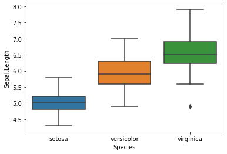
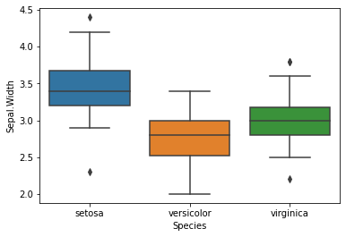
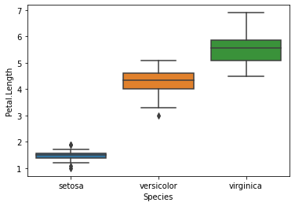
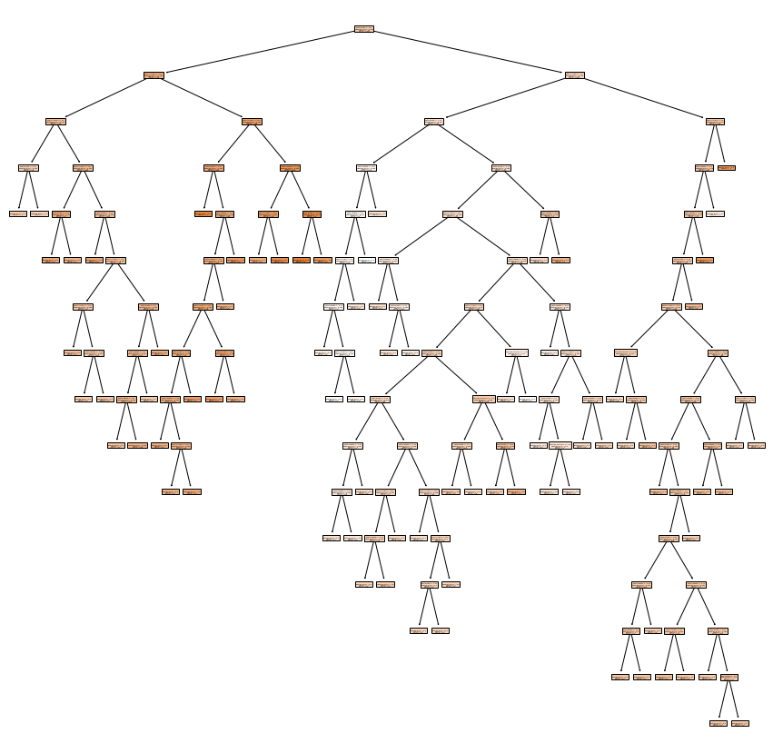
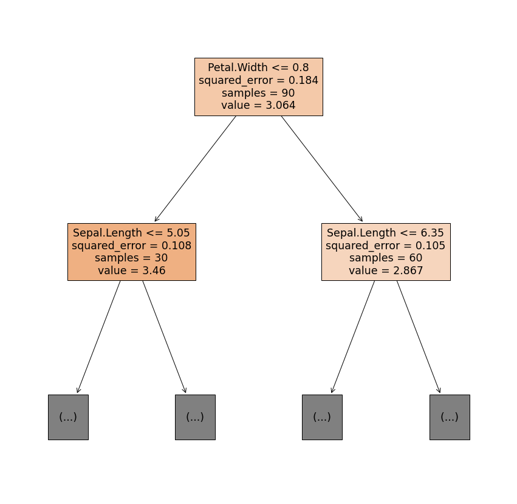
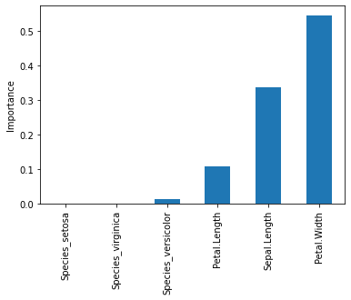
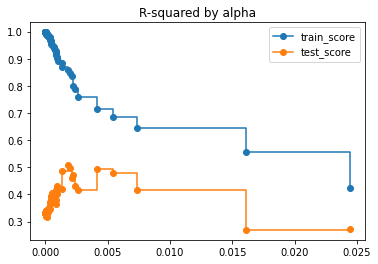
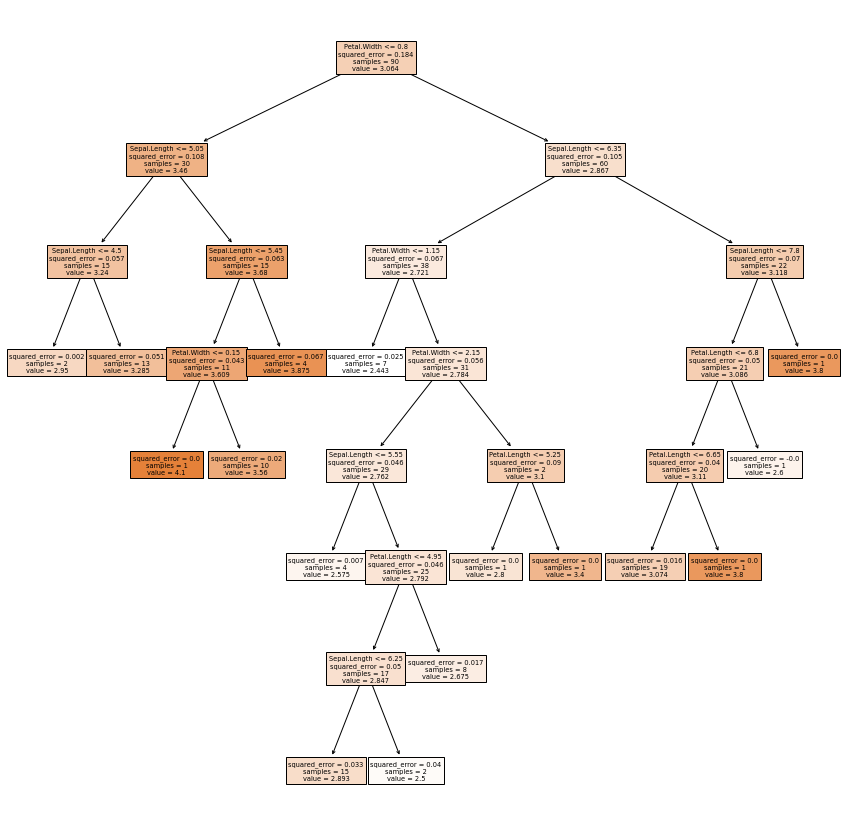

<a href="https://colab.research.google.com/github/LamineTourelab/Tutorial/blob/main/DecisionTrees_using_iris_dataset.ipynb" target="_parent"></a>

# Working with Regression Trees in Python

## Objectives

Decision Trees are one of the most popular approaches to supervised machine learning. Decison Trees use an inverted tree-like structure to model the relationship between independent variables and a dependent variable. A tree with a continuous dependent variable is known as a **Regression Tree**. In this script, i will :

+ Load, explore and prepare iris data
+ Build a Regression Tree model
+ Visualize the structure of the Regression Tree
+ Prune the Regression Tree

## 1. Load the iris Data


```python
from sklearn.datasets import load_iris
iris
```


  <div id="df-aff0ebb3-cc81-4d5b-95bb-5c93ad26e3f6">
    <div class="colab-df-container">
      <div>
<style scoped>
    .dataframe tbody tr th:only-of-type {
        vertical-align: middle;
    }

    .dataframe tbody tr th {
        vertical-align: top;
    }

    .dataframe thead th {
        text-align: right;
    }
</style>
<table border="1" class="dataframe">
  <thead>
    <tr style="text-align: right;">
      <th></th>
      <th>Sepal.Length</th>
      <th>Sepal.Width</th>
      <th>Petal.Length</th>
      <th>Petal.Width</th>
      <th>Species</th>
    </tr>
  </thead>
  <tbody>
    <tr>
      <th>0</th>
      <td>5.1</td>
      <td>3.5</td>
      <td>1.4</td>
      <td>0.2</td>
      <td>setosa</td>
    </tr>
    <tr>
      <th>1</th>
      <td>4.9</td>
      <td>3.0</td>
      <td>1.4</td>
      <td>0.2</td>
      <td>setosa</td>
    </tr>
    <tr>
      <th>2</th>
      <td>4.7</td>
      <td>3.2</td>
      <td>1.3</td>
      <td>0.2</td>
      <td>setosa</td>
    </tr>
    <tr>
      <th>3</th>
      <td>4.6</td>
      <td>3.1</td>
      <td>1.5</td>
      <td>0.2</td>
      <td>setosa</td>
    </tr>
    <tr>
      <th>4</th>
      <td>5.0</td>
      <td>3.6</td>
      <td>1.4</td>
      <td>0.2</td>
      <td>setosa</td>
    </tr>
    <tr>
      <th>...</th>
      <td>...</td>
      <td>...</td>
      <td>...</td>
      <td>...</td>
      <td>...</td>
    </tr>
    <tr>
      <th>145</th>
      <td>6.7</td>
      <td>3.0</td>
      <td>5.2</td>
      <td>2.3</td>
      <td>virginica</td>
    </tr>
    <tr>
      <th>146</th>
      <td>6.3</td>
      <td>2.5</td>
      <td>5.0</td>
      <td>1.9</td>
      <td>virginica</td>
    </tr>
    <tr>
      <th>147</th>
      <td>6.5</td>
      <td>3.0</td>
      <td>5.2</td>
      <td>2.0</td>
      <td>virginica</td>
    </tr>
    <tr>
      <th>148</th>
      <td>6.2</td>
      <td>3.4</td>
      <td>5.4</td>
      <td>2.3</td>
      <td>virginica</td>
    </tr>
    <tr>
      <th>149</th>
      <td>5.9</td>
      <td>3.0</td>
      <td>5.1</td>
      <td>1.8</td>
      <td>virginica</td>
    </tr>
  </tbody>
</table>
<p>150 rows × 5 columns</p>
</div>
      <button class="colab-df-convert" onclick="convertToInteractive('df-aff0ebb3-cc81-4d5b-95bb-5c93ad26e3f6')"
              title="Convert this dataframe to an interactive table."
              style="display:none;">

  <svg xmlns="http://www.w3.org/2000/svg" height="24px"viewBox="0 0 24 24"
       width="24px">
    <path d="M0 0h24v24H0V0z" fill="none"/>
    <path d="M18.56 5.44l.94 2.06.94-2.06 2.06-.94-2.06-.94-.94-2.06-.94 2.06-2.06.94zm-11 1L8.5 8.5l.94-2.06 2.06-.94-2.06-.94L8.5 2.5l-.94 2.06-2.06.94zm10 10l.94 2.06.94-2.06 2.06-.94-2.06-.94-.94-2.06-.94 2.06-2.06.94z"/><path d="M17.41 7.96l-1.37-1.37c-.4-.4-.92-.59-1.43-.59-.52 0-1.04.2-1.43.59L10.3 9.45l-7.72 7.72c-.78.78-.78 2.05 0 2.83L4 21.41c.39.39.9.59 1.41.59.51 0 1.02-.2 1.41-.59l7.78-7.78 2.81-2.81c.8-.78.8-2.07 0-2.86zM5.41 20L4 18.59l7.72-7.72 1.47 1.35L5.41 20z"/>
  </svg>
      </button>

  <style>
    .colab-df-container {
      display:flex;
      flex-wrap:wrap;
      gap: 12px;
    }

    .colab-df-convert {
      background-color: #E8F0FE;
      border: none;
      border-radius: 50%;
      cursor: pointer;
      display: none;
      fill: #1967D2;
      height: 32px;
      padding: 0 0 0 0;
      width: 32px;
    }

    .colab-df-convert:hover {
      background-color: #E2EBFA;
      box-shadow: 0px 1px 2px rgba(60, 64, 67, 0.3), 0px 1px 3px 1px rgba(60, 64, 67, 0.15);
      fill: #174EA6;
    }

    [theme=dark] .colab-df-convert {
      background-color: #3B4455;
      fill: #D2E3FC;
    }

    [theme=dark] .colab-df-convert:hover {
      background-color: #434B5C;
      box-shadow: 0px 1px 3px 1px rgba(0, 0, 0, 0.15);
      filter: drop-shadow(0px 1px 2px rgba(0, 0, 0, 0.3));
      fill: #FFFFFF;
    }
  </style>

      <script>
        const buttonEl =
          document.querySelector('#df-aff0ebb3-cc81-4d5b-95bb-5c93ad26e3f6 button.colab-df-convert');
        buttonEl.style.display =
          google.colab.kernel.accessAllowed ? 'block' : 'none';

        async function convertToInteractive(key) {
          const element = document.querySelector('#df-aff0ebb3-cc81-4d5b-95bb-5c93ad26e3f6');
          const dataTable =
            await google.colab.kernel.invokeFunction('convertToInteractive',
                                                     [key], {});
          if (!dataTable) return;

          const docLinkHtml = 'Like what you see? Visit the ' +
            '<a target="_blank" href=https://colab.research.google.com/notebooks/data_table.ipynb>data table notebook</a>'
            + ' to learn more about interactive tables.';
          element.innerHTML = '';
          dataTable['output_type'] = 'display_data';
          await google.colab.output.renderOutput(dataTable, element);
          const docLink = document.createElement('div');
          docLink.innerHTML = docLinkHtml;
          element.appendChild(docLink);
        }
      </script>
    </div>
  </div>


## 2. Explore the Data


```python
iris.info()
```

    <class 'pandas.core.frame.DataFrame'>
    RangeIndex: 150 entries, 0 to 149
    Data columns (total 5 columns):
     #   Column        Non-Null Count  Dtype  
    ---  ------        --------------  -----  
     0   Sepal.Length  150 non-null    float64
     1   Sepal.Width   150 non-null    float64
     2   Petal.Length  150 non-null    float64
     3   Petal.Width   150 non-null    float64
     4   Species       150 non-null    object 
    dtypes: float64(4), object(1)
    memory usage: 6.0+ KB


```python
iris.describe()
```


  <div id="df-a4bef2c2-a072-413c-b08f-8b8e90188b1c">
    <div class="colab-df-container">
      <div>
<style scoped>
    .dataframe tbody tr th:only-of-type {
        vertical-align: middle;
    }

    .dataframe tbody tr th {
        vertical-align: top;
    }

    .dataframe thead th {
        text-align: right;
    }
</style>
<table border="1" class="dataframe">
  <thead>
    <tr style="text-align: right;">
      <th></th>
      <th>Sepal.Length</th>
      <th>Sepal.Width</th>
      <th>Petal.Length</th>
      <th>Petal.Width</th>
    </tr>
  </thead>
  <tbody>
    <tr>
      <th>count</th>
      <td>150.000000</td>
      <td>150.000000</td>
      <td>150.000000</td>
      <td>150.000000</td>
    </tr>
    <tr>
      <th>mean</th>
      <td>5.843333</td>
      <td>3.057333</td>
      <td>3.758000</td>
      <td>1.199333</td>
    </tr>
    <tr>
      <th>std</th>
      <td>0.828066</td>
      <td>0.435866</td>
      <td>1.765298</td>
      <td>0.762238</td>
    </tr>
    <tr>
      <th>min</th>
      <td>4.300000</td>
      <td>2.000000</td>
      <td>1.000000</td>
      <td>0.100000</td>
    </tr>
    <tr>
      <th>25%</th>
      <td>5.100000</td>
      <td>2.800000</td>
      <td>1.600000</td>
      <td>0.300000</td>
    </tr>
    <tr>
      <th>50%</th>
      <td>5.800000</td>
      <td>3.000000</td>
      <td>4.350000</td>
      <td>1.300000</td>
    </tr>
    <tr>
      <th>75%</th>
      <td>6.400000</td>
      <td>3.300000</td>
      <td>5.100000</td>
      <td>1.800000</td>
    </tr>
    <tr>
      <th>max</th>
      <td>7.900000</td>
      <td>4.400000</td>
      <td>6.900000</td>
      <td>2.500000</td>
    </tr>
  </tbody>
</table>
</div>
      <button class="colab-df-convert" onclick="convertToInteractive('df-a4bef2c2-a072-413c-b08f-8b8e90188b1c')"
              title="Convert this dataframe to an interactive table."
              style="display:none;">

  <svg xmlns="http://www.w3.org/2000/svg" height="24px"viewBox="0 0 24 24"
       width="24px">
    <path d="M0 0h24v24H0V0z" fill="none"/>
    <path d="M18.56 5.44l.94 2.06.94-2.06 2.06-.94-2.06-.94-.94-2.06-.94 2.06-2.06.94zm-11 1L8.5 8.5l.94-2.06 2.06-.94-2.06-.94L8.5 2.5l-.94 2.06-2.06.94zm10 10l.94 2.06.94-2.06 2.06-.94-2.06-.94-.94-2.06-.94 2.06-2.06.94z"/><path d="M17.41 7.96l-1.37-1.37c-.4-.4-.92-.59-1.43-.59-.52 0-1.04.2-1.43.59L10.3 9.45l-7.72 7.72c-.78.78-.78 2.05 0 2.83L4 21.41c.39.39.9.59 1.41.59.51 0 1.02-.2 1.41-.59l7.78-7.78 2.81-2.81c.8-.78.8-2.07 0-2.86zM5.41 20L4 18.59l7.72-7.72 1.47 1.35L5.41 20z"/>
  </svg>
      </button>

  <style>
    .colab-df-container {
      display:flex;
      flex-wrap:wrap;
      gap: 12px;
    }

    .colab-df-convert {
      background-color: #E8F0FE;
      border: none;
      border-radius: 50%;
      cursor: pointer;
      display: none;
      fill: #1967D2;
      height: 32px;
      padding: 0 0 0 0;
      width: 32px;
    }

    .colab-df-convert:hover {
      background-color: #E2EBFA;
      box-shadow: 0px 1px 2px rgba(60, 64, 67, 0.3), 0px 1px 3px 1px rgba(60, 64, 67, 0.15);
      fill: #174EA6;
    }

    [theme=dark] .colab-df-convert {
      background-color: #3B4455;
      fill: #D2E3FC;
    }

    [theme=dark] .colab-df-convert:hover {
      background-color: #434B5C;
      box-shadow: 0px 1px 3px 1px rgba(0, 0, 0, 0.15);
      filter: drop-shadow(0px 1px 2px rgba(0, 0, 0, 0.3));
      fill: #FFFFFF;
    }
  </style>

      <script>
        const buttonEl =
          document.querySelector('#df-a4bef2c2-a072-413c-b08f-8b8e90188b1c button.colab-df-convert');
        buttonEl.style.display =
          google.colab.kernel.accessAllowed ? 'block' : 'none';

        async function convertToInteractive(key) {
          const element = document.querySelector('#df-a4bef2c2-a072-413c-b08f-8b8e90188b1c');
          const dataTable =
            await google.colab.kernel.invokeFunction('convertToInteractive',
                                                     [key], {});
          if (!dataTable) return;

          const docLinkHtml = 'Like what you see? Visit the ' +
            '<a target="_blank" href=https://colab.research.google.com/notebooks/data_table.ipynb>data table notebook</a>'
            + ' to learn more about interactive tables.';
          element.innerHTML = '';
          dataTable['output_type'] = 'display_data';
          await google.colab.output.renderOutput(dataTable, element);
          const docLink = document.createElement('div');
          docLink.innerHTML = docLinkHtml;
          element.appendChild(docLink);
        }
      </script>
    </div>
  </div>


```python
%matplotlib inline
from matplotlib import pyplot as plt
import seaborn as sns
```


```python
ay=sns.boxplot(data = iris, x='Species', y = 'Sepal.Length')
```


    

    


```python
ax=sns.boxplot(data = iris, x='Species', y = 'Sepal.Width')
```


    

    


```python
ax=sns.boxplot(data = iris, x='Species', y = 'Petal.Length')
```


    

    


```python
ax=sns.boxplot(data = iris, x='Species', y = 'Petal.Width')
```


    

    


```python
ax = sns.scatterplot(data = iris,
                     x = 'Sepal.Length',
                     y = 'Sepal.Width',
                     hue = 'Species',
                     style = 'Species',
                     s = 150)
ax = plt.legend(bbox_to_anchor = (1.02, 1), loc = 'upper left')
```


    

    


```python
ax = sns.scatterplot(data = iris,
                     x = 'Petal.Length',
                     y = 'Petal.Width',
                     hue = 'Species',
                     style = 'Species',
                     s = 150)
ax = plt.legend(bbox_to_anchor = (1.02, 1), loc = 'upper left')
```


    

    


## 3. Prepare the Data


```python
import pandas as pd
```


```python
y=iris[['Sepal.Width']]
```


```python
X=iris[['Species','Sepal.Length',  'Petal.Length', 'Petal.Width']]
```


```python
from sklearn.model_selection import train_test_split
X_train, X_test, y_train, y_test = train_test_split(X, y,
                                                    train_size = 0.6,
                                                    stratify = X['Species'],
                                                    random_state = 1234)
```


```python
X_train.shape, X_test.shape
```


    ((90, 4), (60, 4))


```python
X_train.head()
```


  <div id="df-1fd56078-c9d3-4e9a-b338-1183eead04ff">
    <div class="colab-df-container">
      <div>
<style scoped>
    .dataframe tbody tr th:only-of-type {
        vertical-align: middle;
    }

    .dataframe tbody tr th {
        vertical-align: top;
    }

    .dataframe thead th {
        text-align: right;
    }
</style>
<table border="1" class="dataframe">
  <thead>
    <tr style="text-align: right;">
      <th></th>
      <th>Species</th>
      <th>Sepal.Length</th>
      <th>Petal.Length</th>
      <th>Petal.Width</th>
    </tr>
  </thead>
  <tbody>
    <tr>
      <th>61</th>
      <td>versicolor</td>
      <td>5.9</td>
      <td>4.2</td>
      <td>1.5</td>
    </tr>
    <tr>
      <th>79</th>
      <td>versicolor</td>
      <td>5.7</td>
      <td>3.5</td>
      <td>1.0</td>
    </tr>
    <tr>
      <th>8</th>
      <td>setosa</td>
      <td>4.4</td>
      <td>1.4</td>
      <td>0.2</td>
    </tr>
    <tr>
      <th>140</th>
      <td>virginica</td>
      <td>6.7</td>
      <td>5.6</td>
      <td>2.4</td>
    </tr>
    <tr>
      <th>81</th>
      <td>versicolor</td>
      <td>5.5</td>
      <td>3.7</td>
      <td>1.0</td>
    </tr>
  </tbody>
</table>
</div>
      <button class="colab-df-convert" onclick="convertToInteractive('df-1fd56078-c9d3-4e9a-b338-1183eead04ff')"
              title="Convert this dataframe to an interactive table."
              style="display:none;">

  <svg xmlns="http://www.w3.org/2000/svg" height="24px"viewBox="0 0 24 24"
       width="24px">
    <path d="M0 0h24v24H0V0z" fill="none"/>
    <path d="M18.56 5.44l.94 2.06.94-2.06 2.06-.94-2.06-.94-.94-2.06-.94 2.06-2.06.94zm-11 1L8.5 8.5l.94-2.06 2.06-.94-2.06-.94L8.5 2.5l-.94 2.06-2.06.94zm10 10l.94 2.06.94-2.06 2.06-.94-2.06-.94-.94-2.06-.94 2.06-2.06.94z"/><path d="M17.41 7.96l-1.37-1.37c-.4-.4-.92-.59-1.43-.59-.52 0-1.04.2-1.43.59L10.3 9.45l-7.72 7.72c-.78.78-.78 2.05 0 2.83L4 21.41c.39.39.9.59 1.41.59.51 0 1.02-.2 1.41-.59l7.78-7.78 2.81-2.81c.8-.78.8-2.07 0-2.86zM5.41 20L4 18.59l7.72-7.72 1.47 1.35L5.41 20z"/>
  </svg>
      </button>

  <style>
    .colab-df-container {
      display:flex;
      flex-wrap:wrap;
      gap: 12px;
    }

    .colab-df-convert {
      background-color: #E8F0FE;
      border: none;
      border-radius: 50%;
      cursor: pointer;
      display: none;
      fill: #1967D2;
      height: 32px;
      padding: 0 0 0 0;
      width: 32px;
    }

    .colab-df-convert:hover {
      background-color: #E2EBFA;
      box-shadow: 0px 1px 2px rgba(60, 64, 67, 0.3), 0px 1px 3px 1px rgba(60, 64, 67, 0.15);
      fill: #174EA6;
    }

    [theme=dark] .colab-df-convert {
      background-color: #3B4455;
      fill: #D2E3FC;
    }

    [theme=dark] .colab-df-convert:hover {
      background-color: #434B5C;
      box-shadow: 0px 1px 3px 1px rgba(0, 0, 0, 0.15);
      filter: drop-shadow(0px 1px 2px rgba(0, 0, 0, 0.3));
      fill: #FFFFFF;
    }
  </style>

      <script>
        const buttonEl =
          document.querySelector('#df-1fd56078-c9d3-4e9a-b338-1183eead04ff button.colab-df-convert');
        buttonEl.style.display =
          google.colab.kernel.accessAllowed ? 'block' : 'none';

        async function convertToInteractive(key) {
          const element = document.querySelector('#df-1fd56078-c9d3-4e9a-b338-1183eead04ff');
          const dataTable =
            await google.colab.kernel.invokeFunction('convertToInteractive',
                                                     [key], {});
          if (!dataTable) return;

          const docLinkHtml = 'Like what you see? Visit the ' +
            '<a target="_blank" href=https://colab.research.google.com/notebooks/data_table.ipynb>data table notebook</a>'
            + ' to learn more about interactive tables.';
          element.innerHTML = '';
          dataTable['output_type'] = 'display_data';
          await google.colab.output.renderOutput(dataTable, element);
          const docLink = document.createElement('div');
          docLink.innerHTML = docLinkHtml;
          element.appendChild(docLink);
        }
      </script>
    </div>
  </div>


```python
X_train = pd.get_dummies(X_train)
X_train.head()
```


  <div id="df-4d5be8cf-b7fa-4cbf-8b51-3b6ab376a2dc">
    <div class="colab-df-container">
      <div>
<style scoped>
    .dataframe tbody tr th:only-of-type {
        vertical-align: middle;
    }

    .dataframe tbody tr th {
        vertical-align: top;
    }

    .dataframe thead th {
        text-align: right;
    }
</style>
<table border="1" class="dataframe">
  <thead>
    <tr style="text-align: right;">
      <th></th>
      <th>Sepal.Length</th>
      <th>Petal.Length</th>
      <th>Petal.Width</th>
      <th>Species_setosa</th>
      <th>Species_versicolor</th>
      <th>Species_virginica</th>
    </tr>
  </thead>
  <tbody>
    <tr>
      <th>61</th>
      <td>5.9</td>
      <td>4.2</td>
      <td>1.5</td>
      <td>0</td>
      <td>1</td>
      <td>0</td>
    </tr>
    <tr>
      <th>79</th>
      <td>5.7</td>
      <td>3.5</td>
      <td>1.0</td>
      <td>0</td>
      <td>1</td>
      <td>0</td>
    </tr>
    <tr>
      <th>8</th>
      <td>4.4</td>
      <td>1.4</td>
      <td>0.2</td>
      <td>1</td>
      <td>0</td>
      <td>0</td>
    </tr>
    <tr>
      <th>140</th>
      <td>6.7</td>
      <td>5.6</td>
      <td>2.4</td>
      <td>0</td>
      <td>0</td>
      <td>1</td>
    </tr>
    <tr>
      <th>81</th>
      <td>5.5</td>
      <td>3.7</td>
      <td>1.0</td>
      <td>0</td>
      <td>1</td>
      <td>0</td>
    </tr>
  </tbody>
</table>
</div>
      <button class="colab-df-convert" onclick="convertToInteractive('df-4d5be8cf-b7fa-4cbf-8b51-3b6ab376a2dc')"
              title="Convert this dataframe to an interactive table."
              style="display:none;">

  <svg xmlns="http://www.w3.org/2000/svg" height="24px"viewBox="0 0 24 24"
       width="24px">
    <path d="M0 0h24v24H0V0z" fill="none"/>
    <path d="M18.56 5.44l.94 2.06.94-2.06 2.06-.94-2.06-.94-.94-2.06-.94 2.06-2.06.94zm-11 1L8.5 8.5l.94-2.06 2.06-.94-2.06-.94L8.5 2.5l-.94 2.06-2.06.94zm10 10l.94 2.06.94-2.06 2.06-.94-2.06-.94-.94-2.06-.94 2.06-2.06.94z"/><path d="M17.41 7.96l-1.37-1.37c-.4-.4-.92-.59-1.43-.59-.52 0-1.04.2-1.43.59L10.3 9.45l-7.72 7.72c-.78.78-.78 2.05 0 2.83L4 21.41c.39.39.9.59 1.41.59.51 0 1.02-.2 1.41-.59l7.78-7.78 2.81-2.81c.8-.78.8-2.07 0-2.86zM5.41 20L4 18.59l7.72-7.72 1.47 1.35L5.41 20z"/>
  </svg>
      </button>

  <style>
    .colab-df-container {
      display:flex;
      flex-wrap:wrap;
      gap: 12px;
    }

    .colab-df-convert {
      background-color: #E8F0FE;
      border: none;
      border-radius: 50%;
      cursor: pointer;
      display: none;
      fill: #1967D2;
      height: 32px;
      padding: 0 0 0 0;
      width: 32px;
    }

    .colab-df-convert:hover {
      background-color: #E2EBFA;
      box-shadow: 0px 1px 2px rgba(60, 64, 67, 0.3), 0px 1px 3px 1px rgba(60, 64, 67, 0.15);
      fill: #174EA6;
    }

    [theme=dark] .colab-df-convert {
      background-color: #3B4455;
      fill: #D2E3FC;
    }

    [theme=dark] .colab-df-convert:hover {
      background-color: #434B5C;
      box-shadow: 0px 1px 3px 1px rgba(0, 0, 0, 0.15);
      filter: drop-shadow(0px 1px 2px rgba(0, 0, 0, 0.3));
      fill: #FFFFFF;
    }
  </style>

      <script>
        const buttonEl =
          document.querySelector('#df-4d5be8cf-b7fa-4cbf-8b51-3b6ab376a2dc button.colab-df-convert');
        buttonEl.style.display =
          google.colab.kernel.accessAllowed ? 'block' : 'none';

        async function convertToInteractive(key) {
          const element = document.querySelector('#df-4d5be8cf-b7fa-4cbf-8b51-3b6ab376a2dc');
          const dataTable =
            await google.colab.kernel.invokeFunction('convertToInteractive',
                                                     [key], {});
          if (!dataTable) return;

          const docLinkHtml = 'Like what you see? Visit the ' +
            '<a target="_blank" href=https://colab.research.google.com/notebooks/data_table.ipynb>data table notebook</a>'
            + ' to learn more about interactive tables.';
          element.innerHTML = '';
          dataTable['output_type'] = 'display_data';
          await google.colab.output.renderOutput(dataTable, element);
          const docLink = document.createElement('div');
          docLink.innerHTML = docLinkHtml;
          element.appendChild(docLink);
        }
      </script>
    </div>
  </div>


```python
X_test = pd.get_dummies(X_test)
X_test.head()
```


  <div id="df-a18e98cb-6a64-49f3-a1d5-4dd723bbdbd3">
    <div class="colab-df-container">
      <div>
<style scoped>
    .dataframe tbody tr th:only-of-type {
        vertical-align: middle;
    }

    .dataframe tbody tr th {
        vertical-align: top;
    }

    .dataframe thead th {
        text-align: right;
    }
</style>
<table border="1" class="dataframe">
  <thead>
    <tr style="text-align: right;">
      <th></th>
      <th>Sepal.Length</th>
      <th>Petal.Length</th>
      <th>Petal.Width</th>
      <th>Species_setosa</th>
      <th>Species_versicolor</th>
      <th>Species_virginica</th>
    </tr>
  </thead>
  <tbody>
    <tr>
      <th>60</th>
      <td>5.0</td>
      <td>3.5</td>
      <td>1.0</td>
      <td>0</td>
      <td>1</td>
      <td>0</td>
    </tr>
    <tr>
      <th>132</th>
      <td>6.4</td>
      <td>5.6</td>
      <td>2.2</td>
      <td>0</td>
      <td>0</td>
      <td>1</td>
    </tr>
    <tr>
      <th>75</th>
      <td>6.6</td>
      <td>4.4</td>
      <td>1.4</td>
      <td>0</td>
      <td>1</td>
      <td>0</td>
    </tr>
    <tr>
      <th>119</th>
      <td>6.0</td>
      <td>5.0</td>
      <td>1.5</td>
      <td>0</td>
      <td>0</td>
      <td>1</td>
    </tr>
    <tr>
      <th>46</th>
      <td>5.1</td>
      <td>1.6</td>
      <td>0.2</td>
      <td>1</td>
      <td>0</td>
      <td>0</td>
    </tr>
  </tbody>
</table>
</div>
      <button class="colab-df-convert" onclick="convertToInteractive('df-a18e98cb-6a64-49f3-a1d5-4dd723bbdbd3')"
              title="Convert this dataframe to an interactive table."
              style="display:none;">

  <svg xmlns="http://www.w3.org/2000/svg" height="24px"viewBox="0 0 24 24"
       width="24px">
    <path d="M0 0h24v24H0V0z" fill="none"/>
    <path d="M18.56 5.44l.94 2.06.94-2.06 2.06-.94-2.06-.94-.94-2.06-.94 2.06-2.06.94zm-11 1L8.5 8.5l.94-2.06 2.06-.94-2.06-.94L8.5 2.5l-.94 2.06-2.06.94zm10 10l.94 2.06.94-2.06 2.06-.94-2.06-.94-.94-2.06-.94 2.06-2.06.94z"/><path d="M17.41 7.96l-1.37-1.37c-.4-.4-.92-.59-1.43-.59-.52 0-1.04.2-1.43.59L10.3 9.45l-7.72 7.72c-.78.78-.78 2.05 0 2.83L4 21.41c.39.39.9.59 1.41.59.51 0 1.02-.2 1.41-.59l7.78-7.78 2.81-2.81c.8-.78.8-2.07 0-2.86zM5.41 20L4 18.59l7.72-7.72 1.47 1.35L5.41 20z"/>
  </svg>
      </button>

  <style>
    .colab-df-container {
      display:flex;
      flex-wrap:wrap;
      gap: 12px;
    }

    .colab-df-convert {
      background-color: #E8F0FE;
      border: none;
      border-radius: 50%;
      cursor: pointer;
      display: none;
      fill: #1967D2;
      height: 32px;
      padding: 0 0 0 0;
      width: 32px;
    }

    .colab-df-convert:hover {
      background-color: #E2EBFA;
      box-shadow: 0px 1px 2px rgba(60, 64, 67, 0.3), 0px 1px 3px 1px rgba(60, 64, 67, 0.15);
      fill: #174EA6;
    }

    [theme=dark] .colab-df-convert {
      background-color: #3B4455;
      fill: #D2E3FC;
    }

    [theme=dark] .colab-df-convert:hover {
      background-color: #434B5C;
      box-shadow: 0px 1px 3px 1px rgba(0, 0, 0, 0.15);
      filter: drop-shadow(0px 1px 2px rgba(0, 0, 0, 0.3));
      fill: #FFFFFF;
    }
  </style>

      <script>
        const buttonEl =
          document.querySelector('#df-a18e98cb-6a64-49f3-a1d5-4dd723bbdbd3 button.colab-df-convert');
        buttonEl.style.display =
          google.colab.kernel.accessAllowed ? 'block' : 'none';

        async function convertToInteractive(key) {
          const element = document.querySelector('#df-a18e98cb-6a64-49f3-a1d5-4dd723bbdbd3');
          const dataTable =
            await google.colab.kernel.invokeFunction('convertToInteractive',
                                                     [key], {});
          if (!dataTable) return;

          const docLinkHtml = 'Like what you see? Visit the ' +
            '<a target="_blank" href=https://colab.research.google.com/notebooks/data_table.ipynb>data table notebook</a>'
            + ' to learn more about interactive tables.';
          element.innerHTML = '';
          dataTable['output_type'] = 'display_data';
          await google.colab.output.renderOutput(dataTable, element);
          const docLink = document.createElement('div');
          docLink.innerHTML = docLinkHtml;
          element.appendChild(docLink);
        }
      </script>
    </div>
  </div>


## 4. Train and Evaluate the Regression Tree


```python
from sklearn.tree import DecisionTreeRegressor
regressor = DecisionTreeRegressor(random_state = 1234)
```


```python
model = regressor.fit(X_train, y_train)
```


```python
model.score(X_test, y_test)
```


    0.33023514005921195


```python
y_test_pred = model.predict(X_test)
y_test_pred
```


    array([2.3 , 2.8 , 3.2 , 2.5 , 3.4 , 3.  , 3.4 , 3.1 , 3.1 , 3.1 , 2.9 ,
           3.1 , 2.5 , 3.2 , 3.5 , 2.8 , 3.3 , 3.6 , 3.6 , 2.8 , 3.  , 3.4 ,
           2.6 , 3.1 , 2.3 , 2.2 , 3.2 , 2.8 , 3.  , 2.5 , 3.  , 3.  , 3.2 ,
           3.1 , 3.1 , 3.2 , 3.4 , 3.6 , 2.3 , 3.2 , 2.8 , 3.1 , 3.  , 3.8 ,
           3.  , 3.4 , 3.4 , 3.6 , 3.8 , 3.45, 2.9 , 2.7 , 2.9 , 3.4 , 2.3 ,
           3.  , 2.9 , 3.4 , 2.9 , 2.9 ])


```python
from sklearn.metrics import mean_absolute_error
mean_absolute_error(y_test, y_test_pred)
```


    0.28083333333333343


## 5. Visualize the Regression Tree


```python
from sklearn import tree
plt.figure(figsize = (15,15))
tree.plot_tree(model,
                   feature_names = list(X_train.columns),
                   filled = True);
```


    

    


```python
plt.figure(figsize = (15,15))
tree.plot_tree(model,
               feature_names = list(X_train.columns),
               filled = True,
               max_depth = 1);
```


    

    


```python
importance = model.feature_importances_
importance
```


    array([0.33538054, 0.10600708, 0.54609818, 0.        , 0.01251419,
           0.        ])


```python
feature_importance = pd.Series(importance, index = X_train.columns)
feature_importance.sort_values().plot(kind = 'bar')
plt.ylabel('Importance');
```


    

    


## 6. Prune the Regression Tree

Pruning is use in decision trees training to avoid overfitting. It's can happen if we allow it to grow to its max depth and in another hand we can also stop the it earlier. To avoid overfitting, we can apply early stopping rules know as pre-pruning. Another option to avoid overfitting is to apply post-pruning (sometimes just called pruning). If you want to learn about these two methods, check these articles, for [pre-pruning](https://towardsdatascience.com/pre-pruning-or-post-pruning-1dbc8be5cb14), and [post-pruning](https://towardsdatascience.com/build-better-decision-trees-with-pruning-8f467e73b107).


```python
model.score(X_train, y_train)
```


    0.9972869047938048


```python
model.score(X_test, y_test)
```


    0.33023514005921195


Let's get the list of effective alphas for the training data.


```python
path = regressor.cost_complexity_pruning_path(X_train, y_train)
ccp_alphas = path.ccp_alphas
list(ccp_alphas)
```


    [0.0,
     3.947459643111668e-17,
     3.947459643111668e-17,
     7.894919286223336e-17,
     7.894919286223336e-17,
     9.868649107779169e-17,
     4.166666666660903e-05,
     5.5555555555465556e-05,
     5.55555555555445e-05,
     5.555555555556424e-05,
     5.5555555555593844e-05,
     5.555555555562345e-05,
     6.597222222212274e-05,
     7.407407407402644e-05,
     7.407407407406591e-05,
     7.407407407408565e-05,
     7.407407407414487e-05,
     7.561728395083143e-05,
     8.333333333323781e-05,
     0.00014814814814807263,
     0.0001493827160493745,
     0.0001666666666666039,
     0.00016666666666671244,
     0.000190476190476099,
     0.0002222222222222175,
     0.00022407407407397286,
     0.00023148148148146832,
     0.00029629629629641165,
     0.0003555555555555361,
     0.00036805555555567476,
     0.00037037037037030985,
     0.0004537037037035871,
     0.00046296296296299594,
     0.0004637345679009987,
     0.0005333333333332648,
     0.0006007147498388933,
     0.0006857142857141045,
     0.0007111111111110131,
     0.0007851851851852073,
     0.0008571428571428207,
     0.00088888888888887,
     0.0008888888888888897,
     0.0008888888888891858,
     0.0009074074074073519,
     0.00094814814814832,
     0.0010416666666665877,
     0.0013444444444438769,
     0.0013773504273509158,
     0.00179259259259279,
     0.0019999999999998587,
     0.002156410256410328,
     0.002209046402724355,
     0.002373995797798869,
     0.002624999999999389,
     0.004160401002505384,
     0.005411255411258784,
     0.007378661708034001,
     0.016133333333333923,
     0.024416090731883597,
     0.07823209876543245]


We remove the maximum effective alpha because it is the trivial tree with just one node.


```python
ccp_alphas = ccp_alphas[:-1]
list(ccp_alphas)
```


    [0.0,
     3.947459643111668e-17,
     3.947459643111668e-17,
     7.894919286223336e-17,
     7.894919286223336e-17,
     9.868649107779169e-17,
     4.166666666660903e-05,
     5.5555555555465556e-05,
     5.55555555555445e-05,
     5.555555555556424e-05,
     5.5555555555593844e-05,
     5.555555555562345e-05,
     6.597222222212274e-05,
     7.407407407402644e-05,
     7.407407407406591e-05,
     7.407407407408565e-05,
     7.407407407414487e-05,
     7.561728395083143e-05,
     8.333333333323781e-05,
     0.00014814814814807263,
     0.0001493827160493745,
     0.0001666666666666039,
     0.00016666666666671244,
     0.000190476190476099,
     0.0002222222222222175,
     0.00022407407407397286,
     0.00023148148148146832,
     0.00029629629629641165,
     0.0003555555555555361,
     0.00036805555555567476,
     0.00037037037037030985,
     0.0004537037037035871,
     0.00046296296296299594,
     0.0004637345679009987,
     0.0005333333333332648,
     0.0006007147498388933,
     0.0006857142857141045,
     0.0007111111111110131,
     0.0007851851851852073,
     0.0008571428571428207,
     0.00088888888888887,
     0.0008888888888888897,
     0.0008888888888891858,
     0.0009074074074073519,
     0.00094814814814832,
     0.0010416666666665877,
     0.0013444444444438769,
     0.0013773504273509158,
     0.00179259259259279,
     0.0019999999999998587,
     0.002156410256410328,
     0.002209046402724355,
     0.002373995797798869,
     0.002624999999999389,
     0.004160401002505384,
     0.005411255411258784,
     0.007378661708034001,
     0.016133333333333923,
     0.024416090731883597]


Next, we train several trees using the different values for alpha.


```python
train_scores, test_scores = [], []
for alpha in ccp_alphas:
    regressor_ = DecisionTreeRegressor(random_state = 1234, ccp_alpha = alpha)
    model_ = regressor_.fit(X_train, y_train)
    train_scores.append(model_.score(X_train, y_train))
    test_scores.append(model_.score(X_test, y_test))
```


```python
plt.plot(ccp_alphas,
         train_scores,
         marker = "o",
         label = 'train_score',
         drawstyle = "steps-post")
plt.plot(ccp_alphas,
         test_scores,
         marker = "o",
         label = 'test_score',
         drawstyle = "steps-post")
plt.legend()
plt.title('R-squared by alpha');
```


    

    


```python
test_scores
```


    [0.33023514005921195,
     0.33023514005921195,
     0.33023514005921195,
     0.33023514005921195,
     0.33023514005921195,
     0.33023514005921195,
     0.33989623662035984,
     0.33989623662035984,
     0.33989623662035984,
     0.3375476827601912,
     0.3407502562058755,
     0.3407502562058755,
     0.3404566869733544,
     0.3374201728915204,
     0.3294493234267061,
     0.3309675804676231,
     0.3294493234267061,
     0.3220988901962767,
     0.3207644845939083,
     0.31867688116264736,
     0.3315133227055339,
     0.330659303120018,
     0.3334348667729443,
     0.3337137303110721,
     0.34737804367932534,
     0.3448129009631634,
     0.3461769600233623,
     0.34807478132450853,
     0.34506863238349283,
     0.3658675677057428,
     0.3738384171705572,
     0.3767859708789002,
     0.3830725039389472,
     0.3952007681915851,
     0.40503907381672744,
     0.3847448715609173,
     0.3891118745679958,
     0.3928467868886516,
     0.4042640798363476,
     0.4015974472530024,
     0.3640205854903058,
     0.3811009772006224,
     0.4152617606212555,
     0.40073156628435425,
     0.42957845006177786,
     0.41970384860425103,
     0.4183886584425567,
     0.4876104326741413,
     0.5081524504377486,
     0.4979042154115587,
     0.4591965609704547,
     0.47294501371578745,
     0.43038709152545673,
     0.41744228965800056,
     0.4923501729589913,
     0.4788247151954669,
     0.41815815226633946,
     0.26935377968606145,
     0.273134441660973]


```python
ix = test_scores.index(max(test_scores))
best_alpha = ccp_alphas[ix]
best_alpha
```


    0.00179259259259279


```python
regressor_ = DecisionTreeRegressor(random_state = 1234, ccp_alpha = best_alpha)
model_ = regressor_.fit(X_train, y_train)
```


```python
model_.score(X_train, y_train)
```


    0.8589647876821336


```python
model_.score(X_test, y_test)
```


    0.5081524504377486


```python
plt.figure(figsize = (15,15))
tree.plot_tree(model_,
                   feature_names = list(X_train.columns),
                   filled = True);
```


    

    

